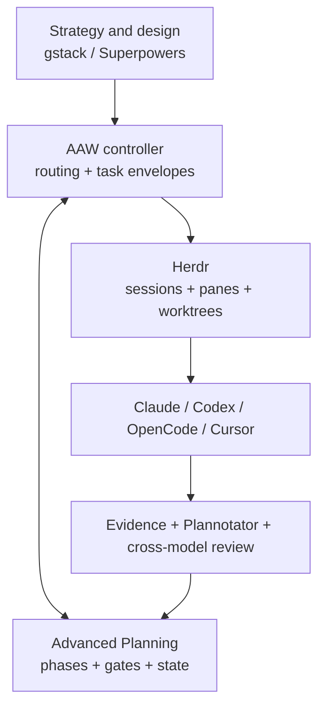
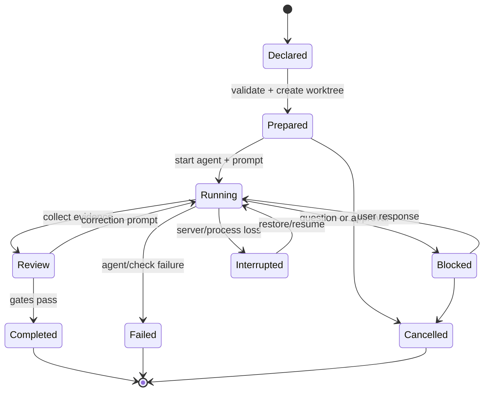
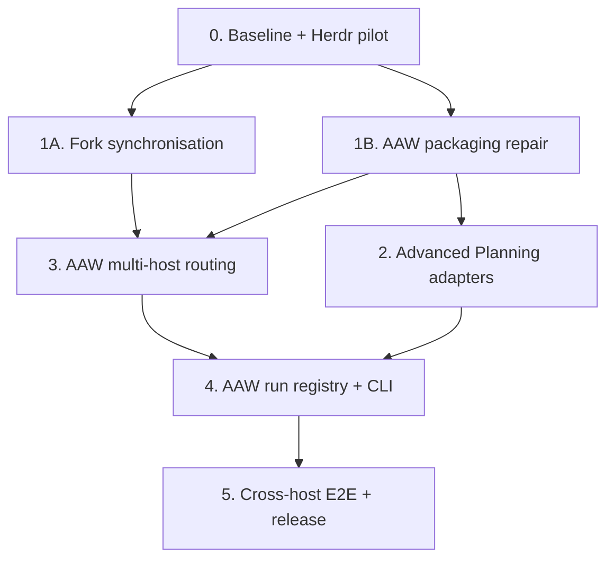

# Herdr-managed multi-runtime orchestration for Advanced AI Workflows

**Status:** implementation-ready design  
**Date:** 2026-08-26  
**Target release:** Advanced AI Workflows v0.2.0  
**Primary environment:** native Windows, PowerShell, Git worktrees  
**Agent runtimes:** Claude Code, Codex, OpenCode, Cursor Agent CLI  
**Execution runtime:** Herdr stable channel

## 1. Decision

Advanced AI Workflows (AAW) will use **Herdr as its terminal and session runtime**, not build another terminal multiplexer. AAW will remain the workflow and integration layer. Advanced Planning will remain the programme planner and state owner. Gstack, Superpowers, and Plannotator will remain independent specialist packages.

The resulting division of responsibility is:

| Layer | Owns | Does not own |
|---|---|---|
| AAW | routing, installation, task envelopes, provider policy, evidence collection, release compatibility | terminal emulation, provider credentials, model APIs |
| Advanced Planning | phases, Ralph loops, todos, gates, resumable programme state | terminal sessions, Git worktree creation |
| Herdr | persistent panes, workspaces, worktrees, agent detection, prompt/wait/read/attach, native session restore | planning semantics, quality gates, package integration |
| Agent runtime | code changes and task-local reasoning | authoritative programme state |
| Git/GitHub | branches, commits, reviewable integration | live agent lifecycle |

Herdr is the recommended replacement for psmux for managed agent sessions. Psmux may remain useful for unrelated shell sessions, but AAW-managed agents must run directly in Herdr so Herdr can see their pane, process, lifecycle, working directory, and native provider session identity.

### 1.1 Options evaluated

| Option | Strength | Limitation for this programme | Decision |
|---|---|---|---|
| Keep psmux as the primary layer | familiar PowerShell terminal multiplexing | AAW would still need to invent cross-provider lifecycle, worktree, prompt/wait/read, and session-identity conventions | retain only for unrelated/manual shells |
| Adopt Herdr | native Windows/ConPTY support, durable sessions, agent-aware status, worktrees, CLI/socket automation, provider integrations | still needs AAW planning/evidence policy; Windows has documented platform caveats | use as the execution runtime |
| Reproduce Proliferate | rich reference for task lifecycle, isolated work, and coordinated agents | its hosted/control-plane scope is substantially larger than a local CLI workflow requires | adopt the lifecycle ideas, not the platform |
| Build a custom AAW multiplexer | maximum control | duplicates solved terminal/process work and creates a large maintenance/security surface | reject |
| Add a thin AAW wrapper over Herdr | preserves AAW-specific contracts without duplicating terminals | should be built only after the manual runbook proves stable | implement in Workstream 4 |

Herdr therefore adds the missing local runtime capabilities, while the useful Proliferate ideas are narrowed to task envelopes, isolated branches, lifecycle state, durable evidence, and controller/worker roles.

## 2. Intended outcome

After v0.2.0, a user can:

1. Use gstack or Superpowers to turn an idea into a reviewed design.
2. Import that design into Advanced Planning.
3. Decompose work into immutable task envelopes.
4. Dispatch short or long tasks to Claude Code, Codex, OpenCode, or Cursor through Herdr.
5. Give every concurrent writing task an isolated Git worktree.
6. Detach from Windows Terminal and later reattach without losing the running panes.
7. Detect blocked, working, idle, failed, or completed work without treating terminal silence as proof of completion.
8. Collect a machine-readable result plus independent Git and test evidence.
9. Run a human or cross-model review gate before merging.
10. Upgrade the component forks from upstream without accidentally discarding local integration behaviour.

The first implementation may be driven with Herdr's existing CLI and the operating guide in `docs/herdr-windows-operations.md`. The thin `aaw` command described below is a later workstream that makes the same workflow repeatable; it is not a prerequisite for beginning the fork updates.

## 3. Non-goals

AAW v0.2 will not:

- reproduce Herdr's PTY, ConPTY, terminal UI, daemon, session restore, or agent detection;
- reproduce Proliferate's hosted control plane, containers, billing, authentication, remote secrets, or web dashboard;
- send prompts directly to model APIs when a supported interactive CLI already exists;
- merge the four component projects into a monorepo;
- permit two orchestration systems to own the same worktree;
- infer success solely from an agent becoming idle;
- automatically force-push, delete a dirty worktree, merge to a default branch, or approve its own work;
- claim native automatic Plannotator review on a host where upstream does not provide it;
- store provider credentials or copy them between runtimes.

## 4. Baseline audit

This snapshot was fetched on 2026-08-26. The implementation must fetch again before creating sync branches because upstream may have moved.

| Repository | Current fork/head | Current upstream | Divergence (`upstream-only / fork-only`) | Required treatment |
|---|---|---|---:|---|
| Advanced AI Workflows | `3422a8c` (2026-06-08) | no external upstream | n/a | repair packaging, add Herdr and multi-runtime integration |
| Advanced Planning | `02b4b86`, tag `v0.16.0` | no external upstream identified | n/a | add runtime-neutral execution contracts and Codex/OpenCode/Cursor adapters |
| gstack | `a5dc03b` | `ad84005` (release subject `v1.69.0.0`) | 89 / 3 | replace the fork tree with current upstream through a reviewed sync branch; the three fork-only commits are merges and have no net tree patch |
| Superpowers | `fde9f97` | `b36e082`, v6.3.0 | 241 / 4 | start from current upstream and re-port only the AAW behavioural intent; do not replay the stale files wholesale |
| Plannotator | `4db7fcc`, v0.19.21 | `b381ecb`, v0.27.8 | 442 / 0 | clean fast-forward through a reviewed sync branch |

### 4.1 Defects in the current AAW repository

The following are release blockers, not optional tidy-up:

1. `.claude/skills/gstack-to-plans/SKILL.md` is referenced by the README, SETUP guide, architecture, setup skill, and smoke tests, but is absent from the tracked repository.
2. `.claude/skills/setup-with-claude/SKILL.md` is a 596-line instruction-only installer. It cannot guarantee a deterministic install, repair drift reliably, or give CI a stable command to exercise.
3. Advanced Planning detection treats the mere existence of `.advanced-plans/` as an installation. A stale data directory therefore produces a false positive.
4. The v0.1 meta-layer is Claude-specific even though current upstream gstack, Superpowers, and Plannotator support several requested hosts.
5. The Windows smoke history proves that `~` in Git Bash can resolve somewhere other than `%USERPROFILE%`. All global installation and run-state paths must be resolved to absolute native paths before use.
6. ROADMAP currently rejects an AAW status command. That decision no longer holds because durable cross-runtime runs introduce state that no component package owns.

### 4.2 Superpowers fork intent to preserve

The current Superpowers fork changes only:

- `skills/brainstorming/SKILL.md`; and
- `skills/using-superpowers/SKILL.md`.

Its intended behaviours are:

- route an approved design to Advanced Planning when Advanced Planning is genuinely installed;
- save the design under `.advanced-plans/specs/` in that case;
- otherwise retain upstream Superpowers planning behaviour;
- ask structured questions at human decision points; and
- acknowledge Advanced Planning and Plannotator as optional companions.

Current upstream has since introduced a three-path brainstorming router, broader host support, worktree-aware design handling, and session-resumption improvements. The sync must preserve those upstream behaviours. AAW-specific routing should preferably live in AAW's adapter/routing layer, not as a permanent deep patch to Superpowers.

## 5. Design principles

1. **One authority per concern.** Herdr owns terminals; Git owns changes; Advanced Planning owns planning state; AAW owns coordination metadata.
2. **One writer per mutable state store.** Only the controller checkout writes `.advanced-plans/state/`, indexes, phase status, or collected evidence.
3. **Isolation follows risk, not duration alone.** Any concurrent writer gets a worktree, even if the task is expected to take two minutes.
4. **Files are the portable protocol.** Plans and envelopes are Markdown/JSON; provider-specific prompt or hook features are adapters.
5. **Standard skills first.** Use `SKILL.md` packages and `AGENTS.md` wherever hosts share the Agent Skills conventions. Add host-specific files only for capabilities that genuinely differ.
6. **Evidence over lifecycle labels.** `idle` or `done` means ready for input; it does not mean tests passed or the requested change is correct.
7. **Upstream by default.** Keep a fork patch only when it represents behaviour that cannot live in AAW or be accepted upstream.
8. **Windows is a first-class platform.** Native PowerShell and paths containing spaces are acceptance-test cases.
9. **Human review at irreversible boundaries.** Push, PR, merge, destructive cleanup, permission broadening, and new dependencies remain explicit gates.
10. **Start manually, automate proven repetition.** The Herdr CLI runbook precedes the `aaw` wrapper so the wrapper codifies an observed workflow.

## 6. Architecture



### 6.1 Controller and worker boundary

The **controller checkout** is the checkout in which the active Advanced Planning programme lives. It may be a normal checkout or a dedicated control worktree. It is the sole writer to:

- `.advanced-plans/PLANS-INDEX.md`;
- `.advanced-plans/phases/`;
- `.advanced-plans/state/`;
- `.advanced-plans/gate-verdicts/`; and
- `.advanced-plans/evidence/`.

A **worker worktree** receives an immutable task envelope and edits only the target repository branch. It must not mark a loop complete, advance a phase, update the central history, or edit control-checkout planning state. A worker may read a copy of planning context embedded in its task envelope.

The controller collects the worker's Herdr transcript, Git status/diff, commit, and check output. The controller then writes the evidence record and decides whether the Advanced Planning loop can advance.

This rule is mandatory because Git worktrees have independent checked-out files. Allowing every worktree to mutate `.advanced-plans/state/` would create divergent state files and non-deterministic merges.

### 6.2 Worktree ownership

Every active checkout has exactly one owner:

| Owner | Meaning |
|---|---|
| `herdr` | Herdr created and manages the worktree for a cross-runtime task |
| `claude` | Claude Code's native worktree/agent mechanism owns it |
| `cursor` | Cursor's own `--worktree` feature owns it |
| `aaw` | the future AAW dispatcher created it directly |
| `none` | normal user checkout; no orchestrator may delete it |

AAW must reject attempts to nest or double-own a worktree. When Herdr is the selected manager, start Cursor in Herdr's existing worktree without Cursor's `--worktree` flag. The same principle applies to Claude-native background agents.

### 6.3 Short bursts versus durable runs

| Task | Default execution |
|---|---|
| read-only question, research, review, or log inspection | native subagent or a Herdr pane in the same checkout; no worktree required |
| single small edit with no other active writer | current controller session is allowed only with an explicit `shared` isolation choice |
| any edit concurrent with another writer | Herdr-managed worktree |
| task that must survive detach/restart or is likely to need follow-up | named Herdr agent in a worktree |
| package sync, migration, refactor, dependency update, or release work | named Herdr agent in a worktree regardless of expected duration |

The default for a writing task is `worktree`. `shared` is an opt-in optimisation, never an inference from a short time estimate.

## 7. Runtime adaptation

### 7.1 Portable source layout

Advanced Planning and AAW skills will have one canonical source and generated/copied host views:

```text
core/
  skills/<skill-name>/SKILL.md
  schemas/
platforms/
  claude-code/
  codex/
  opencode/
  cursor/
```

The installer must copy or symlink from `core/skills/`; it must not maintain four hand-edited copies. On Windows, copying is the safe default because symlink creation varies with Developer Mode and permissions. A generated manifest records source hash, destination hash, package version, and installation time so `refresh` and `doctor` can detect drift.

### 7.2 Host contract

| Host | Project guidance | Project skills | Host-specific integration |
|---|---|---|---|
| Claude Code | fenced block in `CLAUDE.md` | `.claude/skills/<name>/SKILL.md` | `.claude/settings.json`, hooks/plugins where supported |
| Codex | fenced block in `AGENTS.md` | `.agents/skills/<name>/SKILL.md` | no custom prompt files; skills replace deprecated prompts |
| OpenCode | fenced block in `AGENTS.md` | `.agents/skills/` or `.opencode/skills/` | `opencode.json` only for plugins, permissions, or extra instructions |
| Cursor | fenced block in `AGENTS.md` | `.agents/skills/` or `.cursor/skills/` | `.cursor/rules/` only when a scoped Cursor rule is necessary |

AAW will use `.agents/skills/` as the shared project location for Codex, OpenCode, and Cursor. Claude Code receives the same canonical skills under `.claude/skills/`. This reflects the current official discovery rules: Codex loads repository skills from `.agents/skills/`; OpenCode and Cursor both recognise `.agents/skills/`; Claude Code uses `.claude/skills/`.

### 7.3 Advanced Planning adapter requirements

Advanced Planning v0.17.0 will separate core protocol from host mechanics. Each adapter must implement five contracts already described conceptually in `docs/adapting-to-new-platforms.md`:

> **Correction, 2026-08-28.** That document now defines **six** contracts, not five. `Contract 6 —
> Shared Python Runtime` was added to it on 2026-08-27 by this programme's own phase-6 loop-001,
> after this paragraph was written, and it is the contract that decides whether an adapter works
> outside the source checkout. The five numbered requirements below are unaffected — they are §7.3's
> own list, which is a different list from the document's contracts. Any adapter specified against
> this section must also satisfy Contract 6; phase 6's loop-004 was amended on 2026-08-28 to say so
> after being written against the stale count.

1. **Discovery:** install and expose the planning skills.
2. **Invocation:** map phase, loop, gate, resume, and compact actions into the host's skill invocation model.
3. **Delegation:** run worker/reviewer roles using either the host's native subagents or an external AAW/Herdr task.
4. **State I/O:** validate the same core JSON schemas without rewriting paths to a host-private state directory.
5. **Human gate:** invoke native Plannotator integration when available, otherwise print and enforce an explicit manual review command.

Core files must contain no `.claude/`, `.cursor/`, `.opencode/`, Claude-only tool name, or host-specific permission syntax. A CI path audit enforces this.

### 7.4 Plannotator fallbacks

| Host on native Windows | Review behaviour in v0.2 |
|---|---|
| Claude Code | upstream plugin/hook path plus direct `/plannotator-annotate` fallback |
| OpenCode | upstream OpenCode plugin plus direct command fallback |
| Codex | direct `!plannotator annotate <path>` / installed skill; do not claim automatic plan review because upstream documents Codex hooks as disabled on native Windows |
| Cursor | direct `plannotator annotate <path>` terminal gate unless upstream adds a supported Cursor integration |

The controller records which review path was used. Absence of an automatic hook must never silently skip the gate.

## 8. Project configuration

Each managed project receives a tracked `.aaw/project.toml`:

```toml
schema_version = 1
project_id = "advanced-ai-workflows"
control_branch = "main"
planning_root = ".advanced-plans"
default_isolation = "worktree"

[execution]
backend = "herdr"
controller = "claude"
implementers = ["codex", "opencode", "cursor", "claude"]
reviewers = ["codex", "claude"]
max_parallel_writers = 3

[worktrees]
owner = "herdr"
branch_prefix = "agent/"
require_clean_base = true

[gates]
require_tests = true
require_diff_review = true
require_human_for_push = true
require_human_for_merge = true

[components.gstack]
repository = "https://github.com/MungoHarvey/gstack.git"
upstream = "https://github.com/garrytan/gstack.git"

[components.superpowers]
repository = "https://github.com/MungoHarvey/superpowers.git"
upstream = "https://github.com/obra/superpowers.git"

[components.plannotator]
repository = "https://github.com/MungoHarvey/plannotator.git"
upstream = "https://github.com/backnotprop/plannotator.git"

[components.advanced_planning]
repository = "https://github.com/MungoHarvey/advanced-planning.git"
```

`aaw init` merges a fenced routing block into existing `AGENTS.md` and/or `CLAUDE.md`; it does not replace user-authored content. Re-running it is idempotent.

## 9. Run contracts

### 9.1 Local state

Run state is local and must not be committed:

```text
%LOCALAPPDATA%/AdvancedAIWorkflows/
  state.db
  runs/<run-id>/
    task.json
    prompt.md
    transcript.txt
    checks.json
    result.json
```

The implementation resolves `%LOCALAPPDATA%` through the Windows API/environment and stores the resulting absolute path. It never constructs this location from Git Bash `~`.

The controller may copy the final, redacted evidence record into `.advanced-plans/evidence/<run-id>.json`. Transcripts remain local by default because they can contain code, paths, or user data.

### 9.2 Immutable task envelope

`task.json` is created once and never edited. Amendments create a new envelope with `supersedes_run_id`.

Required fields:

```json
{
  "schema_version": 1,
  "run_id": "20260826T153012Z-superpowers-sync-7fd2",
  "project_id": "advanced-ai-workflows",
  "task_id": "phase-01-loop-02-todo-03",
  "title": "Port AAW routing intent onto Superpowers v6.3.0",
  "kind": "implementation",
  "duration": "long",
  "isolation": "worktree",
  "provider": "codex",
  "manager": "herdr",
  "repository": "C:/src/superpowers",
  "base_ref": "upstream/main",
  "base_sha": "b36e0829c6d0140e93cfef2ca599b1b07d4a7797",
  "branch": "sync/upstream-2026-08-26",
  "allowed_paths": ["skills/brainstorming/", "skills/using-superpowers/", "tests/"],
  "forbidden_paths": [".advanced-plans/state/"],
  "spec_paths": [".advanced-plans/specs/2026-08-26-herdr-multi-runtime-orchestration-design.md"],
  "acceptance_checks": ["package test command", "AAW routing fixture tests"],
  "required_evidence": ["git_diff", "tests", "agent_summary", "review"],
  "created_at": "2026-08-26T15:30:12Z"
}
```

Validation rules:

- `run_id`, repository path, base SHA, and branch are resolved before dispatch;
- an implementation or sync task must use `worktree` unless the controller records an explicit shared-write override;
- `allowed_paths` may be broad but cannot be absent for a sync or release task;
- `forbidden_paths` always contains the controller's mutable planning state for worker tasks;
- provider credentials and prompt secrets are not fields in the envelope;
- the base ref is recorded as a full commit SHA alongside its human-readable ref in the database.

### 9.3 Collected result

`result.json` is written by the controller/collector, not trusted directly from the worker:

```json
{
  "schema_version": 1,
  "run_id": "20260826T153012Z-superpowers-sync-7fd2",
  "status": "review",
  "agent": {
    "provider": "codex",
    "herdr_agent": "superpowers-sync",
    "native_session_id": "reported-by-herdr-integration"
  },
  "git": {
    "worktree": "C:/src/.worktrees/superpowers/sync-upstream-2026-08-26",
    "base_sha": "b36e0829c6d0140e93cfef2ca599b1b07d4a7797",
    "head_sha": "dfc537ddf172ae95910df6ee2ee97525d76d3068",
    "dirty": false,
    "changed_paths": ["skills/brainstorming/SKILL.md"]
  },
  "checks": [
    {"command": "project-defined test command", "exit_code": 0, "output_sha256": "78125febce3006a70a3e8c1660f59efd4fb30246e98f6b776480887b17f37f31"}
  ],
  "policy": {
    "path_scope_passed": true,
    "tests_passed": true,
    "independent_review_passed": false
  },
  "agent_summary": "Short worker-supplied summary",
  "collected_at": "2026-08-26T18:20:00Z"
}
```

The worker's prose is one evidence item. The collector independently calculates changed paths, diff summary, commit identity, and check exit codes.

`status` takes its value from the §10 run lifecycle, lower-cased: one of `declared`, `prepared`, `running`, `blocked`, `review`, `completed`, `failed`, `interrupted`, `cancelled`. The example above shows `review`, which is the state a collected result is written in — the gates have not yet been evaluated. There is no separate `review_required` status; §10 is the single definition of the state set, and `core/state/collected-evidence.schema.json` enforces it.

## 10. Run lifecycle



Allowed terminal states are `completed`, `failed`, and `cancelled`. `idle`, `done`, `blocked`, and `unknown` are Herdr lifecycle observations, not AAW terminal states.

## 11. Thin AAW CLI

The target CLI is a small Python package using the standard library (`argparse`, `json`, `sqlite3`, `subprocess`, `pathlib`). The first release adds no mandatory third-party runtime dependency. A PowerShell shim may improve tab completion but is not the core implementation.

| Command | Behaviour |
|---|---|
| `aaw init` | write `.aaw/project.toml`, merge fenced guidance, install/refresh host views |
| `aaw doctor` | verify Git, Herdr, host CLIs, Herdr integrations, package manifests, paths, and drift |
| `aaw dispatch <task.json>` | validate envelope, create/open Herdr worktree, start named agent, submit prompt |
| `aaw list` | show AAW state joined to current Herdr observations |
| `aaw inspect <run>` | show envelope, worktree, agent, checks, and gate state |
| `aaw prompt <run> <text>` | send a follow-up while retaining the audit trail |
| `aaw attach <run>` | attach to the Herdr agent |
| `aaw collect <run>` | read transcript, inspect Git, run declared checks, write result |
| `aaw review <run>` | open configured review path and record verdict |
| `aaw stop <run>` | request graceful agent stop; never delete worktree |
| `aaw resume <run>` | rebind to restored Herdr/native provider session or start a continuation |
| `aaw clean <run>` | remove only a clean, terminal-state Herdr worktree after confirmation |

`aaw list` is the reconsidered status feature. It reports only AAW-owned execution state plus Herdr observations; it does not pretend to synthesise undocumented internal state from every component.

The AAW CLI invokes Herdr's public CLI and parses its JSON. Direct socket API support is deferred until the CLI implementation demonstrates a concrete latency or event-stream requirement.

## 12. Workflow handoffs

| From | To | Contract |
|---|---|---|
| gstack | AAW archive | immutable design Markdown copied to `.advanced-plans/specs/` with origin metadata |
| Superpowers brainstorming | AAW archive | same destination when Advanced Planning is installed; upstream default otherwise |
| AAW archive | Advanced Planning | spec path and content hash passed to phase planning |
| Advanced Planning todo | AAW dispatcher | immutable task envelope with acceptance checks and allowed paths |
| AAW dispatcher | Herdr | workspace/worktree, named agent, prompt, wait/read handles |
| Herdr worker | AAW collector | transcript and live lifecycle; no authority to advance programme state |
| Git/check runner | AAW collector | independent diff and exit-code evidence |
| AAW collector | Advanced Planning gate | redacted result record under `.advanced-plans/evidence/` |
| Gate | Plannotator/gstack reviewer | reviewable plan, diff, or verdict artifact |

The full target cycle is:

```text
gstack/Superpowers design
  -> .advanced-plans/specs
  -> Advanced Planning phase/loop/todo
  -> immutable AAW task envelope
  -> Herdr worktree + chosen runtime
  -> collected Git/test evidence
  -> Plannotator and/or independent model review
  -> Advanced Planning gate and next phase
```

## 13. Upstream and package strategy

### 13.1 Fork policy

Each fork is assigned one of three states in a tracked compatibility manifest:

- `mirror`: no local behaviour; regularly fast-forward or replace tree from upstream;
- `patch`: a minimal, documented local patch is rebased/reimplemented on current upstream;
- `owned`: no external upstream; MungoHarvey is the canonical repository.

Initial states:

| Package | State after migration | Reason |
|---|---|---|
| gstack | `mirror` | current fork has no net local tree change |
| Plannotator | `mirror` | current fork is an ancestor of upstream |
| Superpowers | preferably `mirror`; temporarily `patch` | move AAW routing into AAW; retain a patch only until that adapter is proven |
| Advanced Planning | `owned` | independent project |
| AAW | `owned` | integration meta-project |

### 13.2 Version pinning

AAW releases include a generated compatibility manifest recording:

- repository URL;
- upstream URL if present;
- tested tag and full commit SHA;
- adapter version;
- installation method per host; and
- date and result of the latest compatibility suite.

Installers default to the tested manifest, not a floating `main`. `aaw doctor --latest` may report newer upstream releases but must not silently upgrade them.

### 13.3 Superpowers migration decision

The preferred end state is:

1. install upstream Superpowers through the host's supported mechanism;
2. install a small AAW routing skill/block that detects Advanced Planning through a manifest or `aaw doctor`, not Claude-only paths;
3. let current upstream brainstorming choose its normal paths when AAW/Advanced Planning is absent; and
4. remove the permanent Superpowers fork patch after equivalent cross-host acceptance tests pass.

This minimises future merge cost and avoids overriding upstream's evolved router.

## 14. Implementation workstreams and dependency order



### Workstream 0 — safety baseline and Herdr pilot

Deliverables:

- install Herdr stable natively on Windows;
- install Herdr integrations for `claude`, `codex`, `opencode`, and `cursor`;
- verify each installed CLI can be started, detected, prompted, read, detached, and reattached;
- record current repository heads and rerun divergence calculations;
- establish branch names, backup tags, test commands, and push policy;
- run one read-only cross-provider task and one disposable worktree edit without touching default branches.

Exit gate:

- Herdr correctly reports at least `working`, `idle/done`, and `blocked` for the available agents;
- absolute Windows paths with spaces work;
- a Herdr-created worktree can be removed without `--force` after it is clean;
- controller and worker ownership rules are understood and written into the pilot report.

### Workstream 1A — synchronise component forks

Execute the exact procedures in `docs/upstream-sync-playbook.md`.

- **gstack:** sync from current upstream because the fork has no net patch.
- **Plannotator:** fast-forward to current upstream.
- **Superpowers:** branch from current upstream and reimplement only the integration intent, preferably as AAW-owned routing.

Every repository gets its own Herdr worktree and branch. Gstack and Plannotator may run in parallel. Superpowers remains a separate, higher-risk review lane.

Exit gate:

- upstream and fork relationships are recorded at full SHAs;
- upstream test suites pass;
- Windows installation paths are smoke-tested;
- the Superpowers behaviour matrix passes with and without Advanced Planning;
- no branch has been merged merely because its agent reported completion.

### Workstream 1B — repair AAW packaging

Deliverables:

- restore and track `gstack-to-plans/SKILL.md`;
- add a repository packaging test that fails when any documented install source is absent;
- replace stale-directory detection with an installation manifest plus executable/skill checks;
- add a deterministic, non-interactive audit/install command while retaining the conversational setup skill as a front end;
- resolve global paths to absolute native Windows paths;
- make install, refresh, audit, and uninstall idempotent;
- produce a generated compatibility manifest.

Exit gate:

- fresh checkout contains every documented source artifact;
- CI installs into a temporary project and verifies hashes;
- stale `.advanced-plans/` alone does not count as Advanced Planning installed;
- uninstall removes only AAW-owned fenced blocks/files;
- repeated refresh makes no change when already current.

### Workstream 2 — Advanced Planning multi-runtime adapters

Deliverables:

- move host-neutral skills/schemas into canonical core locations;
- implement Claude Code, Codex, OpenCode, and Cursor adapter installers;
- add the immutable external-task and collected-evidence schemas;
- teach orchestration skills to emit an external task instead of mutating state from a worker worktree;
- add explicit human-review fallback text per host;
- add path and schema tests.

Exit gate:

- all four hosts discover the same named core planning skills;
- a fixture programme can create one phase, one loop, and one external task on every host;
- only the control checkout updates programme state;
- collected evidence advances a loop only after schema and gate validation.

### Workstream 3 — AAW multi-host routing and installer

Deliverables:

- tracked `.aaw/project.toml` schema and parser;
- small fenced `AGENTS.md` routing block shared by Codex/OpenCode/Cursor;
- updated fenced `CLAUDE.md` block for Claude-only mechanics;
- canonical AAW skills installed to `.agents/skills/` and `.claude/skills/`;
- component detection driven by manifests and package commands;
- runtime-specific Plannotator fallbacks;
- current README, architecture, setup, rationale, and roadmap.

Exit gate:

- no host is detected only by another host's private path;
- install and refresh preserve user-authored guidance outside fenced blocks;
- Cursor and OpenCode can use `AGENTS.md`; Codex discovers `.agents/skills/`; Claude discovers `.claude/skills/`;
- the four-tool flow works on Claude and at least the planning-to-task portion works on the other three hosts.

### Workstream 4 — AAW registry and dispatcher

Deliverables:

- zero-dependency Python package and `aaw` entry point;
- SQLite migration/versioning;
- Herdr CLI adapter with structured error handling;
- run state machine and legal-transition tests;
- immutable envelope/result writers;
- `doctor`, `dispatch`, `list`, `inspect`, `prompt`, `attach`, `collect`, `review`, `stop`, `resume`, and `clean`;
- redaction rules and local retention policy.

Exit gate:

- process interruption does not corrupt the registry;
- a restored Herdr/native session can be rebound to its AAW run;
- blocked state surfaces clearly and preserves the question;
- collector catches a changed path outside `allowed_paths`;
- cleanup refuses a dirty or non-terminal worktree;
- no command accepts unresolved `~` as a destructive target.

### Workstream 5 — end-to-end release

Deliverables:

- Windows-native compatibility matrix;
- fixture repositories and recorded commands for all four hosts;
- fork/update regression suite;
- install/refresh/uninstall suite;
- full design-to-gate scenario with two different providers;
- release notes and tested compatibility manifest;
- AAW v0.2.0 and Advanced Planning v0.17.0 tags after all gates pass.

Exit gate:

- all critical acceptance scenarios below pass from fresh clones;
- default branches are protected by reviewed PRs;
- docs do not claim an integration that was only simulated;
- release commits match the manifest SHAs.

## 15. Acceptance scenarios

| ID | Scenario | Pass condition |
|---|---|---|
| ACC-01 | fresh Windows installation in a path containing spaces | `doctor` passes and all configured hosts discover the intended guidance/skills |
| ACC-02 | stale `.advanced-plans/` without adapter | installer reports data present but Advanced Planning absent |
| ACC-03 | gstack design archive | source is copied idempotently with origin and content hash; collision is reviewed |
| ACC-04 | Superpowers with Advanced Planning | current upstream workflow is preserved; approved design lands in `.advanced-plans/specs/` and routes to phase planning |
| ACC-05 | Superpowers without Advanced Planning | normal upstream design/plan path is used; no AAW path is fabricated |
| ACC-06 | short read-only task | may run without a worktree and cannot modify the checkout |
| ACC-07 | two concurrent writing tasks | receive distinct branches/worktrees and one declared owner each |
| ACC-08 | worker attempts planning-state edit | scope policy fails collection and programme state does not advance |
| ACC-09 | Herdr blocked question | AAW reports `blocked`, captures the prompt, and resumes after user input |
| ACC-10 | Herdr detach/reattach | pane and agent continue; controller can inspect the same run later |
| ACC-11 | Herdr server restart | supported provider resumes through official integration or run becomes explicit `interrupted`, never falsely `completed` |
| ACC-12 | idle agent with failing test | collector marks review/failed; idle is not treated as success |
| ACC-13 | changed path outside scope | collection blocks completion and shows the offending path |
| ACC-14 | Codex native Windows plan review | explicit Plannotator command is required and recorded; no automatic-hook claim |
| ACC-15 | upstream sync rerun | fresh fetch updates baseline; no local patch is silently discarded |
| ACC-16 | refresh/uninstall | repeated refresh is a no-op; uninstall preserves user content and component data |
| ACC-17 | dirty worktree cleanup | `clean` refuses; no force deletion is attempted |
| ACC-18 | cross-model gate | reviewer is different from implementer and findings are resolved or explicitly waived by a human |

## 16. Test strategy

### 16.1 Static and unit tests

- schema fixtures for valid and invalid task/result records;
- legal and illegal run-state transitions;
- path normalisation for PowerShell, drive letters, UNC paths, spaces, and Git Bash inputs;
- fenced-block merge/unmerge idempotency;
- manifest hash and drift detection;
- component detector fixtures including stale directories;
- host adapter path audit;
- Herdr JSON parser fixtures for success, blocked, timeout, unknown, and CLI usage error.

### 16.2 Integration tests

- temporary Git repositories and real `git worktree` operations;
- fake Herdr executable for deterministic CI;
- live Herdr smoke suite on native Windows;
- one live provider per host adapter for discovery and a no-op task;
- one two-provider scenario where implementation and review use different agents.

### 16.3 Upgrade tests

- fork before/after tree comparisons;
- install from pinned manifest, update package, refresh host view, verify hash;
- preserve fenced guidance and local configuration across AAW upgrades;
- Superpowers behavioural fixtures against current upstream router;
- Plannotator manual fallback when native hook is unavailable.

## 17. Security and safety

- Provider CLIs remain responsible for authentication. AAW records only provider name and non-secret session references reported by Herdr.
- Prompt and transcript files are local, user-readable, and excluded from Git.
- Evidence copied into the repository is redacted and contains hashes or summaries instead of complete command output where output may be sensitive.
- Task envelopes define path scope and required checks before dispatch.
- Push and merge require a human gate by default.
- Worktree removal validates resolved path, owner, Git worktree membership, terminal run state, and cleanliness.
- `--force`, force-push, destructive reset, and default-branch direct writes are outside the automated happy path.
- Package installers show the upstream URL and tested commit before executing remote scripts.

## 18. Operational risks and mitigations

| Risk | Mitigation |
|---|---|
| upstream moves after this audit | fetch at execution start and regenerate the baseline record |
| stale Superpowers patch overwrites newer routing | implement from upstream head against behaviour tests, not by copying old files |
| worktree state diverges | sole controller writer; immutable task envelopes; collected evidence |
| nested worktree managers | explicit owner field; reject provider-native worktree flags under Herdr |
| terminal idle mistaken for completion | independent collector and gates |
| Windows path mismatch | absolute native paths and path-with-spaces tests |
| Herdr integration absent/outdated | `doctor` requires `herdr integration status`; reinstall before durable runs |
| automatic review unavailable | explicit blocking fallback command recorded in evidence |
| documentation outruns implementation | label v0.2 features as planned until the corresponding acceptance suite passes |
| local transcript contains sensitive data | local-only retention and explicit redaction before repository evidence |

## 19. Documentation deliverables

The implementation must keep these user-facing documents current:

- `README.md` — present implementation status and point to Herdr/update guides;
- `docs/herdr-windows-operations.md` — native Windows installation and daily operation;
- `docs/upstream-sync-playbook.md` — exact fork update procedure and current baseline;
- `docs/herdr-kickoff-prompt.md` — paste-ready controller prompt;
- `ARCHITECTURE.md` — controller/worker, state, and adapter boundaries;
- `DESIGN-RATIONALE.md` — why Herdr and why not a new multiplexer/control plane;
- `SETUP.md` — deterministic multi-host install and refresh;
- `ROADMAP.md` — v0.2 workstreams and gates;
- generated compatibility manifest — tested component tags and SHAs.

## 20. Definition of done

The programme is complete only when:

1. the three forks are current through reviewed branches and their intended local behaviour is documented;
2. AAW contains every source artifact it tells users to install;
3. Advanced Planning has tested adapters for the four requested runtimes;
4. Herdr is the documented and tested execution backend on native Windows;
5. worktree ownership and sole planning-state writer rules are enforced;
6. task and result contracts are versioned and validated;
7. the AAW registry survives interruption and never equates terminal idle with success;
8. install, refresh, sync, run, review, resume, and safe cleanup have acceptance evidence;
9. all user-facing claims match observed behaviour; and
10. release tags and compatibility manifest point at the exact tested commits.

## 21. Source basis

Current behaviour and command contracts in this design were checked against:

- [Herdr repository](https://github.com/herdrdev/herdr)
- [Herdr Windows support](https://herdr.dev/docs/windows-beta/)
- [Herdr agents](https://herdr.dev/docs/agents/)
- [Herdr agent automation](https://herdr.dev/docs/agent-automation/)
- [Herdr CLI reference](https://herdr.dev/docs/cli-reference/)
- [Herdr session restore](https://herdr.dev/docs/session-state/)
- [Codex skills](https://developers.openai.com/codex/build-skills)
- [Codex `AGENTS.md`](https://developers.openai.com/codex/agent-configuration/agents-md)
- [Claude Code skills](https://code.claude.com/docs/en/skills)
- [OpenCode skills](https://opencode.ai/docs/skills/)
- [OpenCode rules](https://opencode.ai/docs/rules/)
- [Cursor skills](https://cursor.com/docs/skills)
- [Cursor CLI rules and worktrees](https://cursor.com/docs/cli/using)
- [gstack upstream](https://github.com/garrytan/gstack)
- [Superpowers upstream](https://github.com/obra/superpowers)
- [Plannotator upstream](https://github.com/backnotprop/plannotator)
- [Proliferate](https://github.com/proliferate-ai/proliferate)

The OpenAI documentation check materially changed the adapter decision: Codex's current repository skill location is `.agents/skills/`, so the design uses that shared standard instead of introducing a new `.codex/skills/` project tree.
