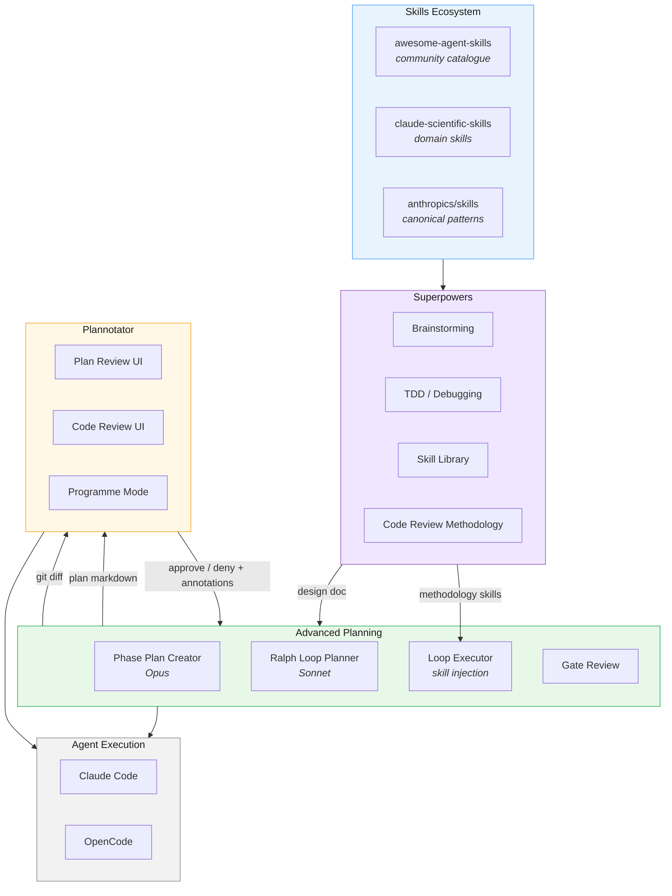
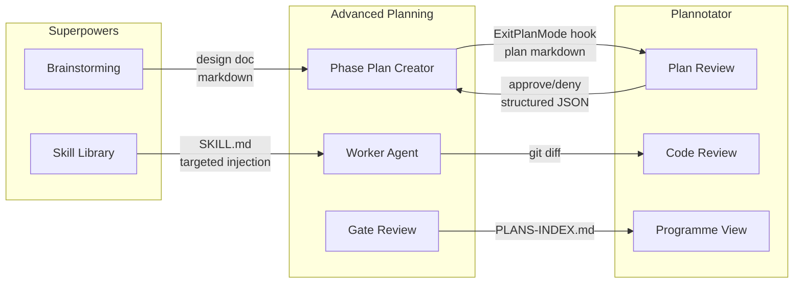
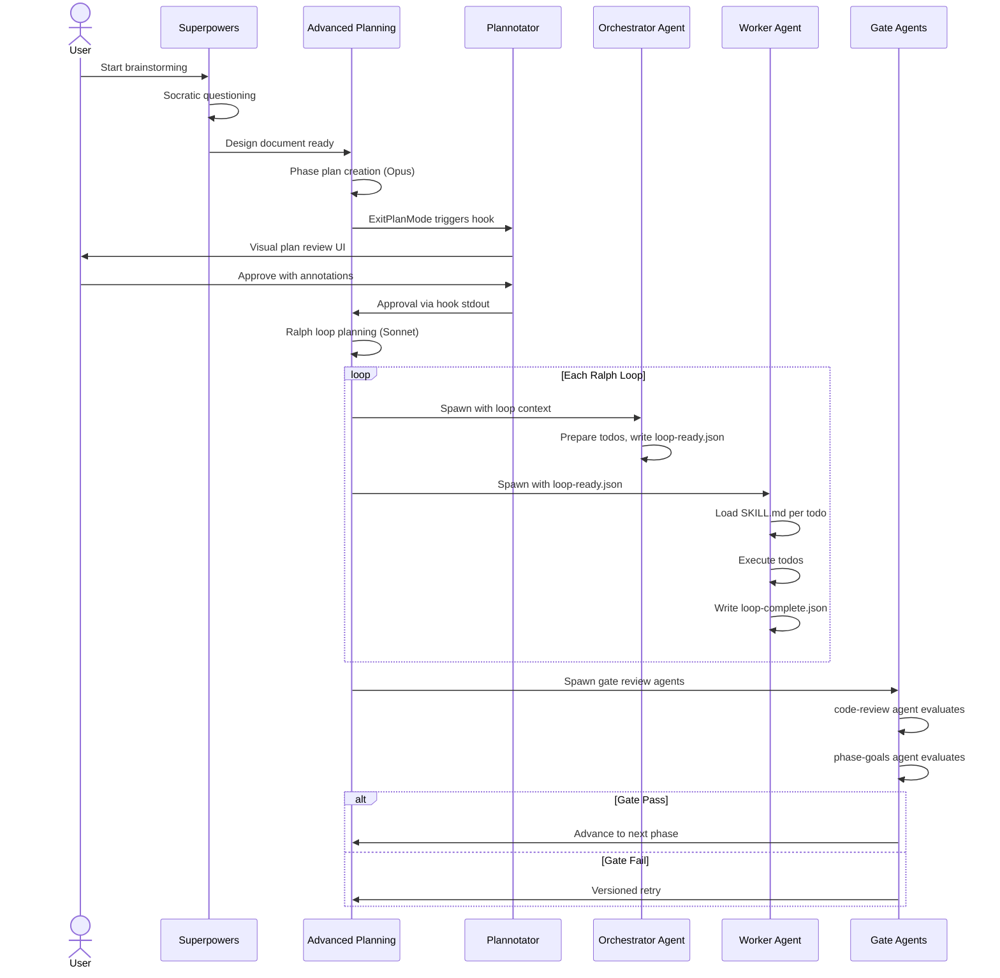
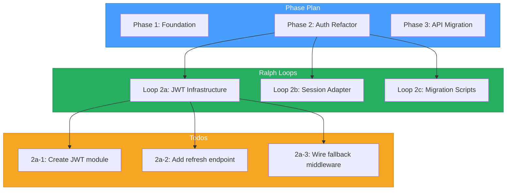
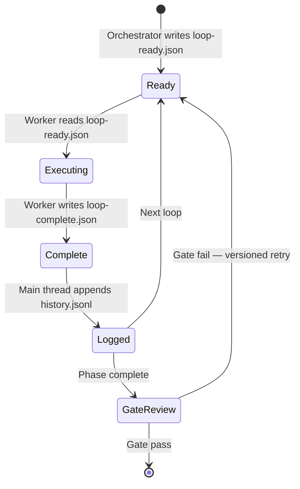
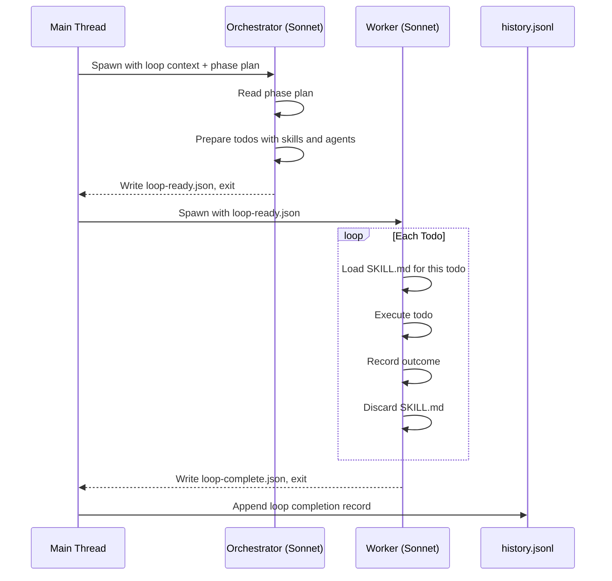
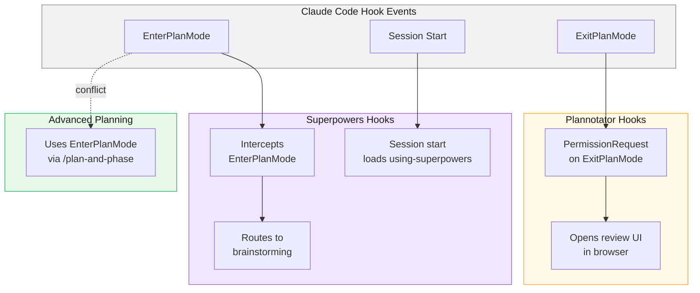

# Architecture

This document is the technical centrepiece of the Advanced AI Workflows meta-repository. It explains how three independent tools — Advanced Planning, Plannotator, and Superpowers — connect to form an integrated planning-review-execution system, without any tool needing to know the internals of the others.

---

## 1. System Overview

Advanced AI Workflows is not a monolithic application. It is a coordinated ecosystem of independently-developed tools, each excelling at a different stage of the agentic development lifecycle. The system is layered: a broad skills ecosystem feeds methodology into a planning framework, which produces artefacts that a visual review tool gates before execution reaches the agent runtime. No layer depends on the implementation details of another — they communicate through files, hook protocols, and markdown documents.

The design philosophy is deliberate: by keeping tools independent and integration shallow, any component can be replaced, upgraded, or used in isolation without breaking the others. A team that only wants visual plan review can use Plannotator alone. A team that only wants hierarchical planning can use Advanced Planning alone. The value of the integrated system is the workflow it enables when all three are present.



The arrows in this diagram represent data flows, not function calls. Superpowers produces a design document that Advanced Planning consumes as input context. Advanced Planning produces plan markdown that Plannotator renders for review. Plannotator produces structured approval or denial that Advanced Planning reads to decide whether to proceed. At execution time, Superpowers methodology skills get injected into individual todos by Advanced Planning's worker agent. The agent runtime (Claude Code or OpenCode) is the substrate on which all of this runs, but it is not tightly coupled to any tool's internals.

---

## 2. Integration Boundaries

The central architectural principle is **boundary integration**: each tool maintains its own internals, its own state management, its own file formats. Integration happens exclusively at handoff points where one tool produces an artefact and another consumes it. This means there are no shared databases, no shared memory, no inter-process communication channels, and no API calls between tools. Everything crosses a boundary as a file or a hook protocol message.

This principle exists for practical reasons. The three tools have different runtimes (Python, Bun/TypeScript, Markdown), different development cadences, and different upstream maintainers. Tight coupling would make it impossible to accept upstream changes from the Plannotator and Superpowers forks without breaking the integration. Boundary integration means each tool can evolve independently, and the integration contracts are small enough to test in isolation.



### Boundary Detail

| Boundary | From | To | What Crosses | Format |
|----------|------|----|--------------|--------|
| Design handoff | Superpowers brainstorming | Advanced Planning phase-plan-creator | Design document with requirements, constraints, scope decisions | Markdown file in `docs/superpowers/plans/` |
| Plan review gate | Advanced Planning phase-plan-creator | Plannotator plan review UI | Phase plan content via ExitPlanMode hook | JSON on stdin (`tool_input.plan` field containing markdown) |
| Review verdict | Plannotator plan review UI | Advanced Planning | Approval or denial with optional annotations | JSON on stdout (`behavior: allow` or `behavior: deny` with message) |
| Skill injection | Superpowers skill library | Advanced Planning worker agent | Methodology skill (TDD, verification, debugging) | Single `SKILL.md` file loaded into worker context per todo |
| Code review gate | Advanced Planning worker agent | Plannotator code review UI | Completed work for visual diff review | Git diff (standard unified format) |
| Programme navigation | Advanced Planning gate review | Plannotator programme view | Phase/loop structure for hierarchical navigation | `PLANS-INDEX.md` linking phase plans and loop files |

Each boundary is intentionally narrow. The design document boundary, for example, is simply a markdown file — Superpowers writes it, Advanced Planning reads it, and neither needs to understand how the other works internally. The hook boundaries are slightly more structured because they follow the Claude Code hook protocol, but even there the contract is just JSON on stdin/stdout with a documented schema.

---

## 3. Data Flow: A Complete Cycle

A full planning-review-execution cycle begins with a user's idea and ends with reviewed, committed code. The following sequence shows every handoff, every tool transition, and every decision point in the integrated workflow.



### What Gets Passed: Concrete Examples

Understanding the architecture requires seeing the actual data that crosses each boundary. Abstract descriptions hide the details that matter most when debugging or extending the system.

**Design document** (Superpowers brainstorming output):

```markdown
# Design: Authentication Refactor

## Intent
Replace the legacy session-based auth with JWT tokens.

## Requirements
- Token refresh without full re-authentication
- Backward compatibility with existing session cookies for 30 days
- No new external dependencies

## Constraints
- Must not change the public API surface
- Migration must be reversible

## Scope Decisions
- OUT: OAuth2 provider support (future phase)
- IN: Token rotation, refresh endpoint, cookie fallback
```

**Hook stdin JSON** (Claude Code to Plannotator):

```json
{
  "tool_name": "ExitPlanMode",
  "tool_input": {
    "plan": "# Phase 2: Authentication Refactor\n\n## Success Criteria\n- All endpoints accept JWT tokens\n- Session cookie fallback works for 30 days\n..."
  }
}
```

**Hook stdout JSON — approval** (Plannotator to Claude Code):

```json
{
  "hookSpecificOutput": {
    "decision": {
      "behavior": "allow"
    }
  }
}
```

**Hook stdout JSON — denial with annotations** (Plannotator to Claude Code):

```json
{
  "hookSpecificOutput": {
    "decision": {
      "behavior": "deny",
      "message": "## Annotations\n**Deletion:** > ~~Add Redis caching layer~~\n**Comment on \"30-day migration window\":** > This should be 90 days — we have enterprise clients on quarterly release cycles.\n**Replacement on \"No new dependencies\":** > Replace with: No new runtime dependencies (dev dependencies acceptable)"
    }
  }
}
```

**State bus files** (Advanced Planning internal handoffs):

`loop-ready.json` — written by the orchestrator agent, read by the worker agent:

```json
{
  "loop_id": "loop-2a",
  "loop_name": "JWT token implementation",
  "phase_plan": ".claude/plans/phase-2-auth-refactor.md",
  "todos": [
    { "id": "2a-1", "content": "Create JWT utility module", "skill": "test-driven-development", "status": "pending" },
    { "id": "2a-2", "content": "Add token refresh endpoint", "skill": "test-driven-development", "status": "pending" },
    { "id": "2a-3", "content": "Wire cookie fallback middleware", "skill": null, "status": "pending" }
  ],
  "context": "Phase 2 focuses on replacing session auth with JWT. Loop 2a covers core token infrastructure."
}
```

`loop-complete.json` — written by the worker agent, read by the main thread:

```json
{
  "loop_id": "loop-2a",
  "handoff": {
    "done": "JWT utility module created with RS256 signing, refresh endpoint returns new token pair, 43 tests passing.",
    "failed": "Cookie fallback middleware deferred — discovered session store interface is more complex than expected.",
    "needed": "Next loop should implement the session store adapter before wiring the fallback middleware."
  },
  "todos": [
    { "id": "2a-1", "status": "complete", "outcome": "src/auth/jwt.ts created, 18 unit tests" },
    { "id": "2a-2", "status": "complete", "outcome": "POST /auth/refresh endpoint, 15 integration tests" },
    { "id": "2a-3", "status": "deferred", "outcome": "Blocked on session store adapter complexity" }
  ]
}
```

The handoff summary is deliberately terse — three fields, one sentence each. This compression is a design choice. The orchestrator for the next loop reads it as context but must not inherit the full working memory of the previous loop. Compression forces the handoff to capture only what matters, preventing context bleed between loops.

---

## 4. The Three-Tier Planning Hierarchy

Advanced Planning decomposes complex programmes into three tiers, each created by a different model tier and operating at a different scope. This hierarchy is not arbitrary — it maps to the natural structure of software projects (milestones contain iterations, iterations contain tasks) and to the capabilities of different language models (broad strategic reasoning vs. focused tactical execution).



### Tier Summary

| Tier | Created By | Model | Scope | Output |
|------|-----------|-------|-------|--------|
| Phase Plan | `phase-plan-creator` skill | Opus | Entire programme phase — milestones, success criteria, dependencies | Markdown document with structured sections |
| Ralph Loops | `ralph-loop-planner` skill | Sonnet | One bounded iteration — 3-8 todos, clear entry/exit criteria | YAML frontmatter with todo array |
| Todos | `plan-todos` + worker agent | Sonnet/Haiku | Single atomic task — one file change, one test, one refactor | YAML todo entry with skill and agent fields |

### Why Model-Tier Routing Matters

The three tiers are assigned to different models because the cognitive demands differ fundamentally at each level. Phase planning requires broad strategic reasoning: understanding project-wide dependencies, anticipating integration risks across subsystems, and making scope decisions that will constrain all downstream work. This is Opus-tier work — the model needs to hold the full project context and reason about trade-offs that span weeks of effort.

Ralph loop planning requires tactical decomposition: breaking a phase into bounded iterations, each small enough to complete in a single focused session, with clear handoff summaries that capture what the next iteration needs to know. Sonnet handles this well — the scope is narrower, the reasoning is more concrete, and the output format is structured enough to constrain hallucination.

Todo execution requires focused implementation: writing code, running tests, making one specific change. Sonnet or Haiku can handle this, especially when a targeted skill (TDD, debugging, verification) is injected to provide methodology. The skill injection means the model does not need to carry the full planning context — it only needs the todo description and the relevant skill.

This tiering also matters for cost and speed. Phase plans are created rarely (once per milestone) and benefit from the most capable model. Loops are planned more frequently but still infrequently enough that Sonnet's cost is acceptable. Todos are executed continuously and benefit from the fastest, cheapest model that can reliably follow a skill's instructions.

### Todo YAML Frontmatter

Each todo in a ralph loop carries structured metadata in YAML frontmatter:

```yaml
todos:
  - id: "2a-1"
    content: "Create JWT utility module with RS256 signing and verification"
    skill: "test-driven-development"
    agent: "worker"
    outcome: ""
    status: "pending"
    complexity: "medium"
  - id: "2a-2"
    content: "Add POST /auth/refresh endpoint with token rotation"
    skill: "test-driven-development"
    agent: "worker"
    outcome: ""
    status: "pending"
    complexity: "medium"
  - id: "2a-3"
    content: "Wire cookie fallback middleware for backward compatibility"
    skill: null
    agent: "worker"
    outcome: ""
    status: "pending"
    complexity: "high"
```

The `skill` field references a single skill to be injected when the worker executes this todo. The `agent` field determines whether the todo runs in the main orchestrator context or is delegated to a subagent. The `outcome` field is empty at planning time and populated by the worker after execution. This structure enables the `plan-skill-identification` and `plan-subagent-identification` skills to operate as separate pipeline stages, each enriching the todo array without modifying the rest of the plan.

---

## 5. State Management

Advanced Planning uses a filesystem-based state bus to coordinate between agents. Three files in a `state/` directory serve as the complete communication channel between the orchestrator agent, the worker agent, and the main thread. No agent reads another agent's context directly — all communication flows through these files.



### State Files

| File | Writer | Reader | Purpose |
|------|--------|--------|---------|
| `loop-ready.json` | Orchestrator agent | Worker agent | Todo list, loop context, skill assignments — everything the worker needs to begin execution |
| `loop-complete.json` | Worker agent | Main thread | Handoff summary (done/failed/needed), todo outcomes, completion status |
| `history.jsonl` | Main thread | Main thread, gate agents | Append-only log of all loop completions, used for progress tracking and gate review context |

### Why Filesystem Over IPC

The choice to use plain files rather than inter-process communication, shared memory, or a database is deliberate and motivated by several constraints of the agentic environment.

**Simplicity.** Agents are language model sessions, not long-running processes. They are spawned, they do their work, and they exit. IPC requires both ends to be alive simultaneously, which is not guaranteed when agents are ephemeral. Files are written by one agent and read by the next — no timing coordination required.

**Debuggability.** When something goes wrong in a multi-agent system, the first question is always "what did each agent actually produce?" With filesystem state, the answer is immediate: open the JSON file and read it. There is no need to attach debuggers, replay message queues, or reconstruct state from logs. The state bus is the log.

**Agent-agnostic.** The state bus works regardless of which runtime hosts the agent. Claude Code, OpenCode, a Python script, or a human operator can all read and write JSON files. This means the planning framework is not locked to any particular agent runtime, and the same state bus pattern works across platforms without adaptation.

**Crash recovery.** If an agent crashes mid-execution, the state files reflect the last completed transition. The main thread can inspect `loop-ready.json` and `loop-complete.json` to determine exactly where execution stopped and resume from that point. There is no corrupt state to recover from — either a file was written completely or it was not written at all.

---

## 6. Agent Orchestration Pattern

Advanced Planning uses a two-agent handoff pattern where the main thread is the sole orchestrator of agent lifecycles. The main thread spawns agents sequentially, never concurrently, and no agent spawns another. This constraint exists to prevent context contamination: if the orchestrator agent could spawn the worker, it would need to carry worker-level context (skill contents, execution details) that would dilute its planning-level reasoning. By keeping agent spawning in the main thread, each agent receives exactly the context it needs and nothing more.



### Why Neither Agent Spawns the Other

The separation is not merely organisational — it is a context isolation mechanism. The orchestrator agent operates at the loop-planning level: it reads the phase plan, understands which todos need to be done, assigns skills and agents, and produces a structured `loop-ready.json`. It does not need to know how any individual skill works, what the code under modification looks like, or what tests exist. If the orchestrator also spawned the worker, it would need to carry all of that context, consuming token budget that should be spent on planning.

The worker agent operates at the execution level: it reads `loop-ready.json`, loads one skill at a time, executes each todo, and records outcomes. It does not need to know the broader phase plan, the programme-level success criteria, or the history of previous loops. The main thread provides exactly what the worker needs (the loop-ready file) and nothing more.

This pattern also enables model flexibility. The orchestrator and worker can run on different models — Sonnet for the orchestrator (which needs structured reasoning about task decomposition), Haiku for the worker (which needs fast, focused execution of individual tasks with skill injection). The main thread makes this routing decision when spawning each agent.

### Targeted Skill Injection

The worker loads exactly one `SKILL.md` file per todo, immediately before executing that todo, and discards it immediately after. This is targeted injection — the opposite of loading all available skills into every agent context.

The rationale is token budget management. A typical skill file is 500-2,000 tokens. A loop might have 5-8 todos, each with a different skill. Loading all skills simultaneously would consume 2,500-16,000 tokens of context window before the agent has even read the task description. With targeted injection, the agent carries only the methodology it needs for the current task, leaving maximum context available for the actual work.

Targeted injection also prevents skill interference. If both a TDD skill and a debugging skill are loaded simultaneously, their instructions may conflict (TDD says "write the test first", debugging says "reproduce the bug first"). By loading one skill at a time, each skill has exclusive influence over the agent's methodology for the duration of that todo.

---

## 7. Hook Coexistence

Claude Code's hook system allows plugins to intercept tool calls, session events, and permission requests. All three tools in the ecosystem register hooks, and these hooks must coexist without conflicting. Understanding the hook landscape is essential for correct installation and troubleshooting.



Plannotator registers a `PermissionRequest` hook that fires when Claude Code calls `ExitPlanMode`. This hook intercepts the plan content, starts a local Bun server on a random port, opens the user's browser to the review UI, and waits for the user to approve or deny. The hook's response (JSON on stdout) determines whether Claude Code proceeds with the plan or re-enters plan mode with the denial message.

Superpowers registers two hooks. The session-start hook loads the `using-superpowers` bootstrap skill on every new conversation, which primes the agent to detect and invoke relevant skills throughout the session. The `EnterPlanMode` interception is not a traditional hook — it is a prompt-level instruction in the `using-superpowers` skill that tells the agent "when you would enter plan mode, route through brainstorming instead." This is a softer interception than Plannotator's hook-level mechanism, but it is also harder to control because it operates through the agent's own reasoning rather than through a deterministic hook.

Advanced Planning does not register hooks directly. Instead, it uses slash commands (`/plan-and-phase`, `/new-phase`) that invoke Claude Code's native plan mode, which then triggers the hook chain. This means Advanced Planning is downstream of both Plannotator and Superpowers in the hook execution flow.

### Known Conflict: EnterPlanMode

Both Superpowers and Advanced Planning respond to the intention to enter plan mode, but they want to do different things with it. Superpowers intercepts `EnterPlanMode` to route through its brainstorming skill, which produces a design document and then chains to its own `writing-plans` skill. Advanced Planning expects to receive control of plan mode to run `phase-plan-creator`, which produces a hierarchical phase plan.

When both tools are installed, the conflict manifests as follows: the user runs `/plan-and-phase`, which would normally trigger `EnterPlanMode`. But Superpowers' bootstrap skill has already instructed the agent to redirect plan mode entries through brainstorming. The brainstorming skill then chains to `writing-plans` — a Superpowers-native plan format — rather than to Advanced Planning's `phase-plan-creator`.

The resolution requires a targeted modification in the Superpowers fork. The `brainstorming` skill's chain target is changed from the hard-coded `writing-plans` to a conditional: when Advanced Planning is detected (by checking for the presence of its skills directory or configuration), brainstorming redirects to `phase-plan-creator` instead of `writing-plans`. This is a prompt-level change — a few lines in `SKILL.md` — not a structural modification to the hook system. The brainstorming methodology itself is unchanged; only its exit routing adapts to the presence of Advanced Planning.

The `using-superpowers` bootstrap skill is also modified in the fork to make its `EnterPlanMode` interception conditional. When Advanced Planning's slash commands are available, the bootstrap defers to Advanced Planning's planning flow rather than asserting control. This allows both tools to coexist: Superpowers provides the brainstorming methodology, and Advanced Planning provides the structural planning framework, with brainstorming feeding into phase plan creation rather than competing with it.

### Hook Ordering

The recommended installation order is: **Superpowers** first, then **Advanced Planning**, then **Plannotator**. This order matters because of how Claude Code resolves hook priority.

**Superpowers first** ensures the bootstrap skill (`using-superpowers`) loads on session start before any planning-specific context. This gives Superpowers the opportunity to prime the agent with methodology awareness. The conditional `EnterPlanMode` interception means it will detect Advanced Planning's presence and defer appropriately.

**Advanced Planning second** installs the slash commands and planning skills. Because Superpowers is already installed and its bootstrap is conditional, there is no conflict — the planning commands work as expected, and brainstorming routes to `phase-plan-creator` when invoked.

**Plannotator last** registers the `PermissionRequest` hook on `ExitPlanMode`. This hook is the final gate before a plan is accepted. Installing it last means it intercepts the output of whichever planning tool produced the plan (Superpowers' `writing-plans` if used standalone, or Advanced Planning's `phase-plan-creator` in the integrated workflow). Because Plannotator hooks at the `ExitPlanMode` event — the end of the planning pipeline — it is agnostic to what produced the plan, and installation order relative to the planning tools does not affect its function. However, installing it last avoids any risk of the hook interfering with the planning tools' own registration.
