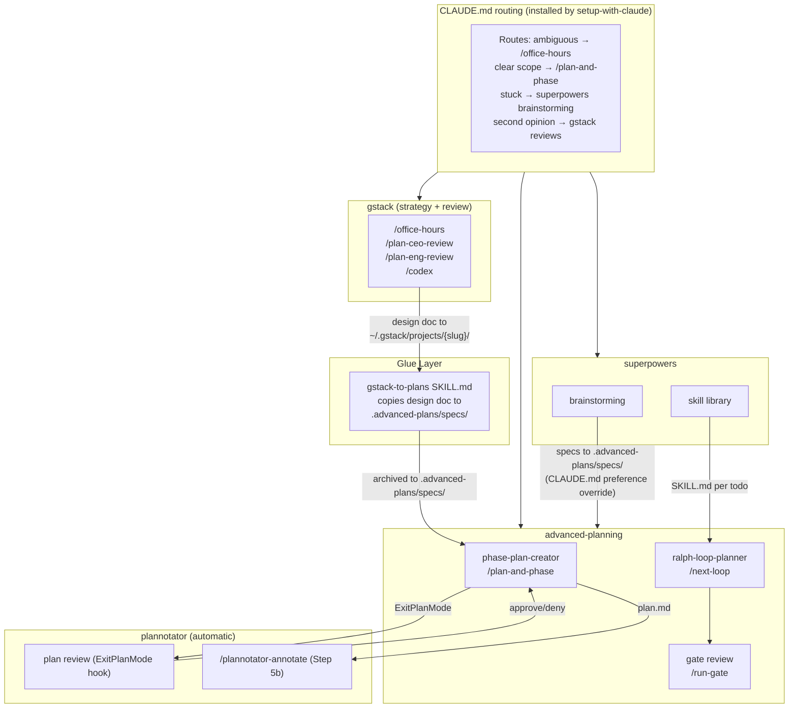
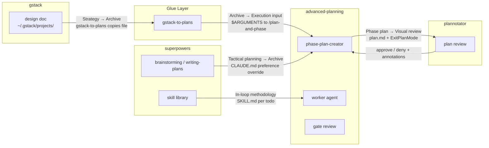
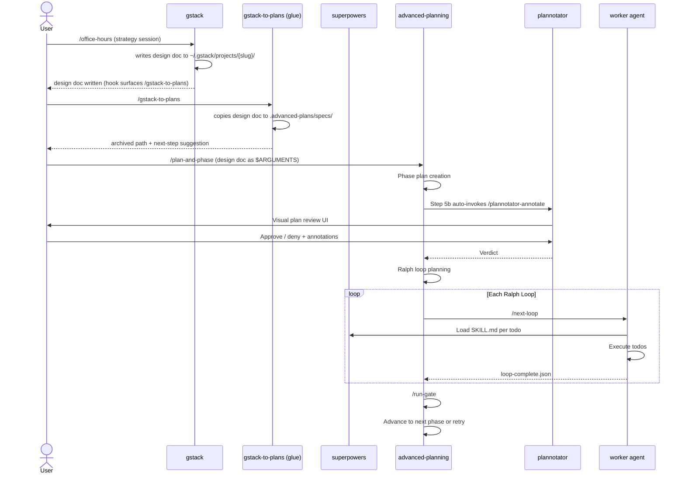
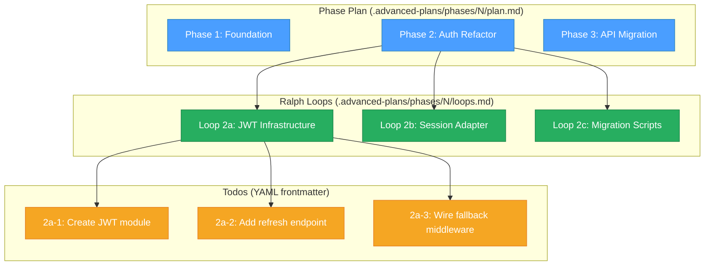
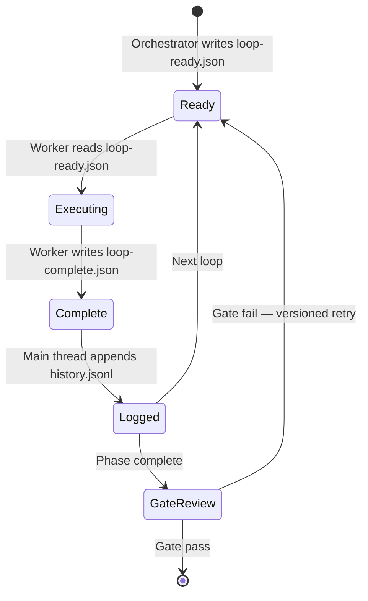
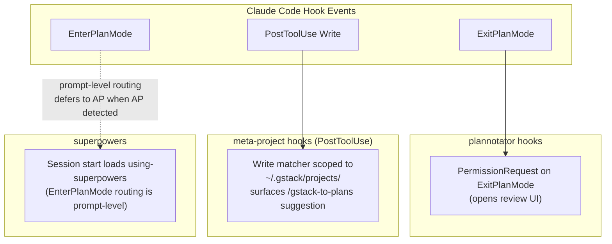

# Architecture

This document is the technical centrepiece of the Advanced AI Workflows meta-repository. It explains how four independent tools — gstack, advanced-planning, superpowers, and plannotator — connect to form an integrated planning-review-execution system, without any tool needing to know the internals of the others.

> **Scope: Claude Code only in v0.1.** CLAUDE.md routing, `.claude/skills/` install paths, Claude plugin install for plannotator/superpowers, and `.claude/settings.json` permission grants are all Claude Code-specific. Multi-runtime support is a v0.2+ ROADMAP item.
>
> **Successor design:** this document remains the implemented v0.1 architecture. The planned Herdr execution layer, controller/worker state boundary, and Claude Code/Codex/OpenCode/Cursor adapters are specified in [the v0.2 orchestration design](.advanced-plans/specs/2026-08-26-herdr-multi-runtime-orchestration-design.md). Where the two differ, v0.1 describes current behaviour and the v0.2 spec describes the implementation target.

---

## 1. System Overview

Advanced AI Workflows is not a monolithic application. It is a coordinated ecosystem of four independently-developed tools, each excelling at a different stage of the agentic development lifecycle. The meta-project owns the glue: a single `gstack-to-plans` skill and a CLAUDE.md routing template that routes user intent to the right tool at the right moment. No layer depends on the implementation details of another — they communicate through files, hook protocols, and markdown documents.

The design philosophy is deliberate: by keeping tools independent and integration shallow, any component can be replaced, upgraded, or used in isolation without breaking the others. The meta-project is responsible for making the four tools play well together while leaving them independently usable.

```mermaid
flowchart TB
    accTitle: Four-Tool System Overview
    accDescr: gstack at the strategic layer produces design docs; the glue layer copies them into the project; advanced-planning runs execution; plannotator and superpowers provide review and methodology.

    subgraph routing["CLAUDE.md routing (installed by setup-with-claude)"]
        rt["Routes: ambiguous → /office-hours<br/>clear scope → /plan-and-phase<br/>stuck → superpowers brainstorming<br/>second opinion → gstack reviews"]
    end

    subgraph gs["gstack (strategy + review)"]
        gh["/office-hours<br/>/plan-ceo-review<br/>/plan-eng-review<br/>/codex"]
    end

    subgraph gl["Glue Layer"]
        gtp["gstack-to-plans SKILL.md<br/>copies design doc to<br/>.advanced-plans/specs/"]
    end

    subgraph sp["superpowers"]
        br["brainstorming"]
        sl["skill library"]
    end

    subgraph ap["advanced-planning"]
        pp["phase-plan-creator<br/>/plan-and-phase"]
        rl["ralph-loop-planner<br/>/next-loop"]
        gate["gate review<br/>/run-gate"]
    end

    subgraph pn["plannotator (automatic)"]
        prv["plan review (ExitPlanMode hook)"]
        ann["/plannotator-annotate (Step 5b)"]
    end

    routing --> gs
    routing --> sp
    routing --> ap
    gh -->|"design doc to<br/>~/.gstack/projects/{slug}/"| gtp
    br -->|"specs to .advanced-plans/specs/<br/>(CLAUDE.md preference override)"| ap
    gtp -->|"archived to .advanced-plans/specs/"| pp
    sl -->|"SKILL.md per todo"| rl
    pp -->|"plan.md"| ann
    pp -->|"ExitPlanMode"| prv
    prv -->|"approve/deny"| pp
    rl --> gate

    classDef routing fill:#f2f2f2,stroke:#888,color:#1a1a1a
    classDef gstack fill:#dbeafe,stroke:#2563eb,color:#1e3a5f
    classDef glue fill:#fef3c7,stroke:#d97706,color:#713f12
    classDef sp fill:#f0e6ff,stroke:#9b59b6,color:#1a1a1a
    classDef ap fill:#e8f8e8,stroke:#27ae60,color:#1a1a1a
    classDef pn fill:#fff8e6,stroke:#f5a623,color:#1a1a1a
```

The arrows represent data flows, not function calls. Gstack produces design docs that the glue skill copies into the project. Superpowers brainstorming and writing-plans write directly to `.advanced-plans/specs/` via a CLAUDE.md preference override — no glue needed. Advanced-planning produces phase plans that plannotator renders for review. Plannotator produces structured approval or denial that advanced-planning reads to decide whether to proceed.

---

## 2. Integration Boundaries

The central architectural principle is **boundary integration**: each tool maintains its own internals, its own state management, its own file formats. Integration happens exclusively at handoff points. This means no shared databases, no shared memory, no API calls between tools. Everything crosses a boundary as a file or hook protocol message.

The four tools have different runtimes (markdown-native, Python, Bun/TypeScript) and different upstream maintainers. Tight coupling would make it impossible to accept upstream changes without breaking the integration. Boundary integration means each tool can evolve independently, and the integration contracts are small enough to test in isolation.

```mermaid
flowchart LR
    accTitle: Integration Boundaries Between Four Tools
    accDescr: Shows the six named handoff boundaries where tools exchange artifacts.

    subgraph gs["gstack"]
        gh_out["design doc<br/>~/.gstack/projects/"]
    end

    subgraph gl["Glue Layer"]
        gtp["gstack-to-plans"]
    end

    subgraph sp["superpowers"]
        br["brainstorming / writing-plans"]
        skill_lib["skill library"]
    end

    subgraph ap["advanced-planning"]
        ppc["phase-plan-creator"]
        worker["worker agent"]
        gate["gate review"]
    end

    subgraph pn["plannotator"]
        prv["plan review"]
    end

    gh_out -->|"Strategy → Archive<br/>gstack-to-plans copies file"| gtp
    gtp -->|"Archive → Execution input<br/>$ARGUMENTS to /plan-and-phase"| ppc
    br -->|"Tactical planning → Archive<br/>CLAUDE.md preference override"| ppc
    skill_lib -->|"In-loop methodology<br/>SKILL.md per todo"| worker
    ppc -->|"Phase plan → Visual review<br/>plan.md + ExitPlanMode"| prv
    prv -->|"approve / deny + annotations"| ppc
```

### Handoff Contracts

| Boundary | From | To | Artifact | Owned by |
|---|---|---|---|---|
| Strategy → Archive | gstack `/office-hours` etc. | project repo | Design doc copied to `.advanced-plans/specs/{filename}.md` | `gstack-to-plans` glue skill |
| Archive → Execution input | user/model (after glue runs) | advanced-planning `/plan-and-phase` or `/new-phase` | Design doc content passed as `$ARGUMENTS` | CLAUDE.md routing instruction |
| Tactical planning → Archive | superpowers `brainstorming` / `writing-plans` | shared archive | Plan/spec markdown written directly to `.advanced-plans/specs/` | CLAUDE.md preference override (no glue) |
| Phase plan → Visual review | advanced-planning `/plan-and-phase` Step 5b | plannotator | `.advanced-plans/phases/phase-N/plan.md` | advanced-planning (already implements this) |
| Plan-mode review | Claude Code `EnterPlanMode`/`ExitPlanMode` | plannotator | Plan content in transient memory | plannotator plugin hooks (automatic on install) |
| In-loop methodology | superpowers skill library | advanced-planning worker | `SKILL.md` injected per todo | advanced-planning (already exists) |
| Gate → Second opinion (deferred) | advanced-planning `/run-gate` | gstack `/plan-eng-review` or `/codex` | Gate verdict + artifacts | Future `gate-to-gstack-review` glue — ROADMAP v0.2 |

Each boundary is intentionally narrow. The design document boundary is simply a markdown file — gstack writes it (under `~/.gstack/projects/`), the glue copies it to `.advanced-plans/specs/`, advanced-planning reads it via `$ARGUMENTS`. Neither tool needs to understand how the other works internally.

---

## 3. Glue Layer

The meta-project's primary contribution is a thin glue layer that bridges the boundary between gstack and advanced-planning. It consists of two artifacts installed by `setup-with-claude`:

### gstack-to-plans skill

A pure markdown `SKILL.md` with no executable helpers. When invoked as `/gstack-to-plans`, Claude reads the skill and:

1. Finds candidate design docs under `~/.gstack/projects/{slug}/` matching the current branch via filename pattern (`{user}-{branch}-design-{datetime}.md`).
2. If multiple matches or any ambiguity (detached HEAD, worktrees, branch-name edge cases): invokes `AskUserQuestion` rather than guessing.
3. Copies the chosen design doc to `.advanced-plans/specs/{filename}.md`. If the destination exists: invokes `AskUserQuestion` presenting the diff and three choices (overwrite / skip / view full diff). No silent overwrite.
4. Updates `.advanced-plans/specs/INDEX.md` with a row for the new artifact.
5. Prints the archived path and tells the user the next command: `/plan-and-phase` or `/new-phase` with the design doc as `$ARGUMENTS`.

**Trigger mechanism (dual):**
- **Primary:** a `PostToolUse` hook in `.claude/settings.json` scoped strictly to writes under `~/.gstack/projects/`. When a gstack design doc is written, the hook surfaces `/gstack-to-plans` to the user in Claude's next turn.
- **Secondary:** manual `/gstack-to-plans` slash command. CLAUDE.md routing also includes the closing instruction "AFTER any gstack planning skill writes a design doc, invoke `/gstack-to-plans` if it has not already fired."

**Hook scope discipline:** the `PostToolUse` matcher is scoped strictly to writes under `~/.gstack/projects/`. It must NOT fire on writes elsewhere — REG-7 tests this negatively.

### CLAUDE.md routing template

A markdown block installed between fenced markers (`<!-- aaw-routing:begin -->` / `<!-- aaw-routing:end -->`) in the project's `CLAUDE.md`. Provides:

- Front-door routing rules for all four tools
- Superpowers preference-override block: sets `brainstorming` and `writing-plans` save location to `.advanced-plans/specs/` (overrides superpowers' stale default of `.claude/plans/`)
- Closing instruction for `/gstack-to-plans` fallback when the hook misfires or is disabled

### What the glue does NOT do

- No exploration-notes.md integration. The design doc reaches `phase-plan-creator` via `$ARGUMENTS` to `/plan-and-phase` or `/new-phase` — not via `.advanced-plans/exploration-notes.md`.
- No plannotator glue. Advanced-planning's `/plan-and-phase` Step 5b already auto-detects plannotator and invokes `/plannotator-annotate` on the phase plan. The meta-project's only responsibility is ensuring `setup-with-claude` installs plannotator as a Claude Code plugin.
- No gate-to-gstack-review glue in v0.1. Deferred to ROADMAP v0.2.

---

## 4. Data Flow: A Complete Cycle

A full planning-review-execution cycle begins with a user's idea and ends with reviewed, committed code.

```mermaid
sequenceDiagram
    accTitle: Complete Four-Tool Workflow Sequence
    accDescr: Shows the handoff sequence from gstack strategy through glue, advanced-planning execution, and plannotator review.

    actor User
    participant GS as gstack
    participant GL as gstack-to-plans (glue)
    participant SP as superpowers
    participant AP as advanced-planning
    participant PN as plannotator
    participant Work as worker agent

    User->>GS: /office-hours (strategy session)
    GS->>GS: writes design doc to ~/.gstack/projects/{slug}/
    GS-->>User: design doc written (hook surfaces /gstack-to-plans)

    User->>GL: /gstack-to-plans
    GL->>GL: copies design doc to .advanced-plans/specs/
    GL-->>User: archived path + next-step suggestion

    User->>AP: /plan-and-phase (design doc as $ARGUMENTS)
    AP->>AP: Phase plan creation
    AP->>PN: Step 5b auto-invokes /plannotator-annotate
    PN->>User: Visual plan review UI
    User->>PN: Approve / deny + annotations
    PN-->>AP: Verdict

    AP->>AP: Ralph loop planning

    loop Each Ralph Loop
        AP->>Work: /next-loop
        Work->>SP: Load SKILL.md per todo
        Work->>Work: Execute todos
        Work-->>AP: loop-complete.json
    end

    AP->>AP: /run-gate
    AP->>AP: Advance to next phase or retry
```

---

## 5. The Three-Tier Planning Hierarchy

Advanced-planning decomposes complex programmes into three tiers, each created by a different model tier and operating at a different scope.

```mermaid
flowchart TB
    accTitle: Three-Tier Planning Hierarchy
    accDescr: Phase Plans decompose into Ralph Loops which decompose into Todos. Each tier uses a different model.

    subgraph Phase["Phase Plan (.advanced-plans/phases/N/plan.md)"]
        P1["Phase 1: Foundation"]
        P2["Phase 2: Auth Refactor"]
        P3["Phase 3: API Migration"]
    end

    subgraph Loops["Ralph Loops (.advanced-plans/phases/N/loops.md)"]
        L1["Loop 2a: JWT Infrastructure"]
        L2["Loop 2b: Session Adapter"]
        L3["Loop 2c: Migration Scripts"]
    end

    subgraph Todos["Todos (YAML frontmatter)"]
        T1["2a-1: Create JWT module"]
        T2["2a-2: Add refresh endpoint"]
        T3["2a-3: Wire fallback middleware"]
    end

    P2 --> L1
    P2 --> L2
    P2 --> L3
    L1 --> T1
    L1 --> T2
    L1 --> T3

    classDef phase fill:#4a9eff,stroke:#2980b9,color:#fff
    classDef loops fill:#27ae60,stroke:#1e8449,color:#fff
    classDef todos fill:#f5a623,stroke:#e67e22,color:#fff

    class P1,P2,P3 phase
    class L1,L2,L3 loops
    class T1,T2,T3 todos
```

| Tier | Created By | Model | Scope | Output |
|------|-----------|-------|-------|--------|
| Phase Plan | `phase-plan-creator` skill | Opus | Entire programme phase — milestones, success criteria, dependencies | Markdown document at `.advanced-plans/phases/N/plan.md` |
| Ralph Loops | `ralph-loop-planner` skill | Sonnet | One bounded iteration — 3-8 todos, clear entry/exit criteria | YAML frontmatter at `.advanced-plans/phases/N/loops.md` |
| Todos | `plan-todos` + worker agent | Sonnet/Haiku | Single atomic task — one file change, one test, one refactor | YAML todo entry with skill and agent fields |

---

## 6. State Management

Advanced-planning uses a filesystem-based state bus to coordinate between agents. Three files in `.advanced-plans/state/` serve as the complete communication channel.

```mermaid
stateDiagram-v2
    accTitle: Advanced Planning State Machine
    accDescr: Shows how loop-ready.json, loop-complete.json, and history.jsonl sequence execution.

    [*] --> Ready: Orchestrator writes loop-ready.json
    Ready --> Executing: Worker reads loop-ready.json
    Executing --> Complete: Worker writes loop-complete.json
    Complete --> Logged: Main thread appends history.jsonl
    Logged --> Ready: Next loop
    Logged --> GateReview: Phase complete
    GateReview --> [*]: Gate pass
    GateReview --> Ready: Gate fail — versioned retry
```

| File | Writer | Reader | Purpose |
|------|--------|--------|---------|
| `.advanced-plans/state/loop-ready.json` | Orchestrator agent | Worker agent | Todo list, loop context, skill assignments |
| `.advanced-plans/state/loop-complete.json` | Worker agent | Main thread | Handoff summary (done/failed/needed), todo outcomes |
| `.advanced-plans/state/history.jsonl` | Main thread | Main thread, gate agents | Append-only log of all loop completions |

---

## 7. Hook Coexistence

Claude Code's hook system allows plugins to intercept tool calls and session events. All four tools interact with hooks.

```mermaid
flowchart TB
    accTitle: Hook Event Map
    accDescr: Shows which hooks each tool registers and how they coexist.

    subgraph events["Claude Code Hook Events"]
        EPM["ExitPlanMode"]
        ENPM["EnterPlanMode"]
        PTU["PostToolUse Write"]
    end

    subgraph pnh["plannotator hooks"]
        pnh1["PermissionRequest on ExitPlanMode<br/>(opens review UI)"]
    end

    subgraph aawh["meta-project hooks (PostToolUse)"]
        aawh1["Write matcher scoped to<br/>~/.gstack/projects/<br/>surfaces /gstack-to-plans suggestion"]
    end

    subgraph sph["superpowers"]
        sph1["Session start loads using-superpowers<br/>(EnterPlanMode routing is prompt-level)"]
    end

    EPM --> pnh1
    PTU --> aawh1
    ENPM -.->|"prompt-level routing<br/>defers to AP when AP detected"| sph1
```

**Plannotator** registers a `PermissionRequest` hook on `ExitPlanMode`. This intercepts the plan, opens the browser review UI, and waits for user approval or denial. Additionally, advanced-planning's `/plan-and-phase` Step 5b directly invokes `/plannotator-annotate` on the written plan file — a second integration point that does not require the ExitPlanMode hook.

**The meta-project's `PostToolUse` hook** fires when a `Write` targets a path under `~/.gstack/projects/`. It checks the filename against the gstack design-doc pattern and surfaces the `/gstack-to-plans` suggestion in Claude's next turn. The hook is scoped strictly — writes elsewhere produce no output.

**Superpowers** uses a prompt-level `EnterPlanMode` interception in the `using-superpowers` bootstrap skill. When advanced-planning is detected, this defers to advanced-planning's planning flow rather than asserting control.

### Known Gap: plannotator ExitPlanMode popups

When plannotator is installed, the `ExitPlanMode` hook fires on every plan-mode exit — including short planning sequences. Users may see the plannotator review UI open more frequently than expected. This is a known behaviour gap documented in SETUP.md. There is no workaround in v0.1 without disabling the hook entirely.

---

## 8. Documented Known Divergences

These are the known places where sub-package defaults diverge from the meta-project's conventions, and how they are resolved:

| Divergence | Sub-package default | Meta-project resolution |
|---|---|---|
| Superpowers `brainstorming` stale save path | Writes to `.claude/plans/` when advanced-planning detected | CLAUDE.md preference override redirects to `.advanced-plans/specs/`. Fix merged into our `MungoHarvey/superpowers` fork so the override becomes redundant for fork users. |
| Advanced-planning `STRUCTURE.md` stale paths | References `plans/`, `.claude/plans/`, `PLANS-INDEX.md` | Meta-project uses v0.11.0 commands/skills as ground truth and ignores `STRUCTURE.md`. Fix prepared as a branch in our `MungoHarvey/advanced-planning` repo, held until after v0.1 smoke test. |
| No active sub-package patches required | — | All integration is via routing, preference overrides, and one glue skill. |
