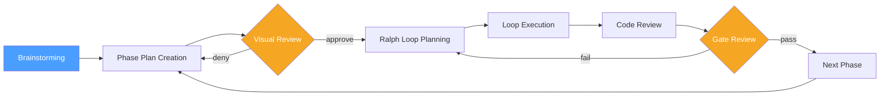

# Advanced AI Workflows

**An integrated planning-review-execution system built from three composable open-source tools.**

---

## The Three Tools

### Advanced Planning

[`MungoHarvey/advanced-planning`](https://github.com/MungoHarvey/advanced-planning)

Hierarchical multi-agent planning framework that decomposes complex programmes into Phases, Ralph Loops, and Todos. It solves the three hardest problems in long-running agentic work: context degradation, scope drift, and session resumption. Each level of the hierarchy has clear entry/exit criteria and handoff summaries, so work can pause and resume without losing momentum.

### Plannotator

[`MungoHarvey/plannotator`](https://github.com/MungoHarvey/plannotator) (fork of [`backnotprop/plannotator`](https://github.com/backnotprop/plannotator))

Browser-based visual plan review and annotation UI. When a plan or code change is ready for review, Plannotator opens an interactive interface where you can approve, deny, or annotate with structured feedback (insertions, deletions, replacements, comments). Programme mode adds hierarchical navigation across phases and loops, keeping review aligned with the planning structure.

### Superpowers

[`MungoHarvey/superpowers`](https://github.com/MungoHarvey/superpowers) (fork of [`obra/superpowers`](https://github.com/obra/superpowers))

Composable development methodology skills for agentic CLI tools. Provides brainstorming, TDD, subagent-driven development, and code review as modular skills that activate contextually. Each skill injects focused instructions into the agent's context at exactly the right moment, then gets out of the way.

### Why Together, Not Separately?

These tools are complementary, not competing. Each excels at a different stage of the development lifecycle:

- **Superpowers** handles the creative and quality phases -- brainstorming intent, enforcing TDD, reviewing code.
- **Advanced Planning** handles the structural phases -- decomposing work, tracking progress, managing handoffs.
- **Plannotator** handles the human-in-the-loop phases -- reviewing plans visually, approving gate criteria, annotating diffs.

Together they cover the full cycle: **think** &rarr; **plan** &rarr; **review** &rarr; **execute** &rarr; **review**.

---

## How They Work Together



The three tools integrate at boundaries, not internals. Superpowers produces a design document through brainstorming; Advanced Planning consumes it to generate a hierarchical phase plan; Plannotator reviews that plan in the browser before execution begins. During execution, Advanced Planning drives the loop/todo structure while Superpowers skills get injected per-todo for methodology enforcement. After each loop, Plannotator provides visual code review, and gate agents evaluate success criteria before the next phase begins.

No tool needs to know the internal implementation of the others. They communicate through files -- plan documents, state JSON, git diffs -- making the integration lightweight and each tool independently replaceable.

---

## Quick Start

**Automated (let Claude do it):** Install the setup skill and tell Claude to set up your project:

```bash
mkdir -p ~/.claude/skills/setup-with-claude
curl -fsSL https://raw.githubusercontent.com/MungoHarvey/advanced-ai-workflows/main/.claude/skills/setup-with-claude/SKILL.md \
  -o ~/.claude/skills/setup-with-claude/SKILL.md
```

Then in any Claude Code session: *"Set up advanced planning in this project."*

**Manual:** Follow the step-by-step instructions in [SETUP.md](SETUP.md).

---

## Documentation

| Document | Description |
|----------|-------------|
| [ARCHITECTURE.md](ARCHITECTURE.md) | System architecture, component boundaries, and data flow |
| [DESIGN-RATIONALE.md](DESIGN-RATIONALE.md) | Why these tools, why this integration approach, key trade-offs |
| [SETUP.md](SETUP.md) | Installation, configuration, and first-run walkthrough |
| [ROADMAP.md](ROADMAP.md) | Planned features, integration milestones, and open questions |

---

## Skills Ecosystem

Finding good skills is key to getting the most out of the Advanced Planning framework. Each todo in a ralph loop can have a skill injected -- a focused markdown file that shapes how the agent approaches that specific task. The right skill turns a generic agent into a domain specialist for exactly the duration it needs to be one.

- [awesome-agent-skills](https://github.com/MungoHarvey/awesome-agent-skills) -- community-curated catalogue of agent skills
- [claude-scientific-skills](https://github.com/K-Dense-AI/claude-scientific-skills) -- scientific research skills for Claude
- [anthropic skills](https://github.com/anthropics/skills) -- official Anthropic reference implementations

---

## Roadmap

See [ROADMAP.md](ROADMAP.md) for planned features, integration milestones, and open questions.

---

## Licence

TBD
