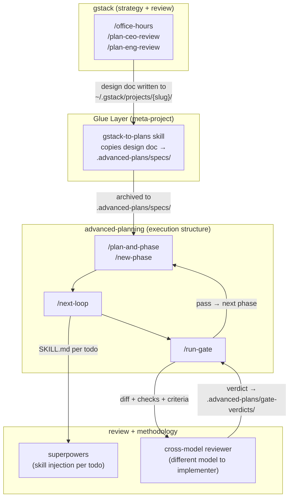

# Advanced AI Workflows

**An integrated planning-review-execution system built from three composable open-source tools — gstack, advanced-planning, and superpowers.**

> **Current implementation: Claude Code only in v0.1.** The CLAUDE.md routing, `.claude/skills/` install paths, and `.claude/settings.json` permission grants are Claude Code-specific. The implementation-ready v0.2 design adds Herdr-managed Claude Code, Codex, OpenCode, and Cursor sessions, but those capabilities remain planned until their acceptance suite passes.
>
> **Known packaging blocker on current `main`:** the repository documents and installer reference `.claude/skills/gstack-to-plans/SKILL.md`, but that source file is not tracked. The v0.2 programme repairs this before publishing a new installer. Treat the existing Quick Start as the v0.1 flow, not a verified fresh-install guarantee at this head.
>
> **Plannotator was deprecated on 2026-08-26.** v0.1 shipped as a four-tool stack including plannotator for visual plan review. From v0.2 the human review gate is a cross-model gate reviewer instead, and plannotator is no longer installed, detected, or routed to. Existing installs keep working; nothing is uninstalled. See [docs/plannotator-deprecation.md](docs/plannotator-deprecation.md).

---

## The Three Tools

### gstack

[`MungoHarvey/gstack`](https://github.com/MungoHarvey/gstack) (or your local gstack install at `~/.claude/skills/gstack/`)

High-level strategic planner and reviewer. Commands like `/office-hours`, `/plan-ceo-review`, `/plan-eng-review`, `/plan-design-review`, and `/codex` are the entry points for ambiguous problems, strategy sessions, and second-opinion reviews. Gstack writes design docs to `~/.gstack/projects/{slug}/` — the immutable origin outside the project repo.

### advanced-planning

[`MungoHarvey/advanced-planning`](https://github.com/MungoHarvey/advanced-planning)

Hierarchical multi-agent planning framework that decomposes complex programmes into Phases, Ralph Loops, and Todos. Solves the three hardest problems in long-running agentic work: context degradation, scope drift, and session resumption. Plans live in `.advanced-plans/` in the project repo (v0.11.0+).

### superpowers

[`MungoHarvey/superpowers`](https://github.com/MungoHarvey/superpowers) (fork of [`obra/superpowers`](https://github.com/obra/superpowers))

Composable development methodology skills. Provides brainstorming, TDD, subagent-driven development, and code review as modular skills injected contextually. Tactical helper invoked throughout execution — not the main planning engine. When installed alongside advanced-planning, brainstorming and writing-plans output lands in `.advanced-plans/specs/` via a CLAUDE.md preference override.

### The review gate

Not a fourth tool — a property of `/run-gate`. At every phase boundary the gate reviewer runs on a
**different model from the implementer**, reads the changed paths, diff, check output, and the
phase plan's success criteria, and writes a structured verdict to `.advanced-plans/gate-verdicts/`.
Every finding is then resolved or explicitly waived by a human before the phase advances.

This replaces plannotator's browser-based annotation UI, which v0.1 used for the same purpose.
Cross-model review is adversarial rather than visual, works identically on all four target
runtimes, and produces machine-readable evidence. See
[docs/plannotator-deprecation.md](docs/plannotator-deprecation.md) for the rationale and the
migration path.

---

## How They Work Together


```mermaid
flowchart TB
    accTitle: Three-Tool Integration Flow
    accDescr: gstack at the top produces design docs; the gstack-to-plans glue copies them into .advanced-plans/specs/; advanced-planning consumes them to build phase plans; superpowers injects methodology skills per todo; a cross-model reviewer gates each phase boundary.

    subgraph gstack_layer["gstack (strategy + review)"]
        gh["/office-hours<br/>/plan-ceo-review<br/>/plan-eng-review"]
    end

    subgraph glue_layer["Glue Layer (meta-project)"]
        gl["gstack-to-plans skill<br/>copies design doc →<br/>.advanced-plans/specs/"]
    end

    subgraph ap_layer["advanced-planning (execution structure)"]
        pp["/plan-and-phase<br/>/new-phase"]
        rl["/next-loop"]
        rg["/run-gate"]
    end

    subgraph review_layer["review + methodology"]
        xm["cross-model reviewer<br/>(different model to implementer)"]
        sp["superpowers<br/>(skill injection per todo)"]
    end

    gh -->|"design doc written to<br/>~/.gstack/projects/{slug}/"| gl
    gl -->|"archived to<br/>.advanced-plans/specs/"| pp
    pp --> rl
    rl -->|"SKILL.md per todo"| sp
    rl --> rg
    rg -->|"diff + checks + criteria"| xm
    xm -->|"verdict →<br/>.advanced-plans/gate-verdicts/"| rg
    rg -->|"pass → next phase"| pp

    classDef gstack fill:#dbeafe,stroke:#2563eb,color:#1e3a5f
    classDef glue fill:#fef3c7,stroke:#d97706,color:#713f12
    classDef ap fill:#dcfce7,stroke:#16a34a,color:#14532d
    classDef review fill:#f3e8ff,stroke:#9333ea,color:#4a044e

    class gh gstack_layer
    class gl glue_layer
    class pp,rl,rg ap_layer
    class xm,sp review_layer
```

The three tools are unaware of each other. The meta-project owns the glue — a single `gstack-to-plans` skill and a CLAUDE.md routing template that routes user intent to the right tool at the right moment. No tool needs to know the other's internals; they communicate through files.

**The full cycle:** `/office-hours` (gstack) → `/gstack-to-plans` (glue) → `/plan-and-phase` (advanced-planning) → `/next-loop` (advanced-planning + superpowers skills) → `/run-gate` (cross-model review) → `/next-phase`.

### Herdr execution layer (v0.2 design)

[Herdr](https://github.com/herdrdev/herdr) will provide persistent native-Windows terminal panes, Git worktrees, agent lifecycle detection, and session restore for Claude Code, Codex, OpenCode, and Cursor. Herdr does not replace any of the four workflow tools: Advanced Planning remains the sole planning-state owner, while isolated workers edit task branches and return evidence to a controller checkout.

The design deliberately starts with Herdr's existing CLI rather than building another multiplexer. See the [complete implementation design](.advanced-plans/specs/2026-08-26-herdr-multi-runtime-orchestration-design.md), [Windows operating guide](docs/herdr-windows-operations.md), and [paste-ready controller prompt](docs/herdr-kickoff-prompt.md).

---

## Quick Start

Install the setup skill and tell Claude to set up your project:

```bash
mkdir -p ~/.claude/skills/setup-with-claude
curl -fsSL https://raw.githubusercontent.com/MungoHarvey/advanced-ai-workflows/main/.claude/skills/setup-with-claude/SKILL.md \
  -o ~/.claude/skills/setup-with-claude/SKILL.md
```

Then in any Claude Code session: *"Set up advanced AI workflows in this project."*

Claude will walk you through detecting and installing each sub-package, wiring the CLAUDE.md routing block, granting `.advanced-plans/` permissions in `.claude/settings.json`, and installing the `gstack-to-plans` glue skill.

**Manual setup:** follow the step-by-step walkthrough in [SETUP.md](SETUP.md).

---

## Documentation

| Document | Description |
|----------|-------------|
| [ARCHITECTURE.md](ARCHITECTURE.md) | System architecture, component boundaries, glue layer, and data flow |
| [DESIGN-RATIONALE.md](DESIGN-RATIONALE.md) | Why these tools, why this integration approach, key trade-offs |
| [SETUP.md](SETUP.md) | Installation, version compatibility matrix, configuration, and first-run walkthrough |
| [ROADMAP.md](ROADMAP.md) | v0.1 status and v0.2 Herdr/multi-runtime delivery order |
| [Herdr Windows operations](docs/herdr-windows-operations.md) | Native-Windows Herdr pilot, worktrees, provider sessions, evidence, and safe cleanup |
| [Upstream sync playbook](docs/upstream-sync-playbook.md) | Current fork divergence and reviewed update procedures for gstack and Superpowers |
| [Upstream baseline snapshot](references/upstream-baseline-2026-08-26.json) | Machine-readable repository heads, divergence, fork-only commits, and intended sync strategy (dated snapshot — not updated in place) |
| [Baseline audit](.advanced-plans/evidence/2026-08-26-baseline-audit.md) | Verified environment and five-repository audit at full SHAs, with deltas from the design snapshot |
| [Plannotator deprecation](docs/plannotator-deprecation.md) | Why plannotator was removed from the stack, what replaces the review gate, and the migration path |
| [Releasing](docs/releasing.md) | Versioning scheme, release procedure, and the push/tag human gate |
| [v0.2 orchestration design](.advanced-plans/specs/2026-08-26-herdr-multi-runtime-orchestration-design.md) | Implementation-ready architecture, contracts, workstreams, and acceptance criteria |
| [Herdr kickoff prompt](docs/herdr-kickoff-prompt.md) | Prompt to start the programme in a Herdr controller session |

---

## Skills Ecosystem

Each todo in a ralph loop can have a skill injected — a focused markdown file that shapes how the agent approaches that specific task. The right skill turns a generic agent into a domain specialist for exactly the duration it needs to be one.

- [awesome-agent-skills](https://github.com/MungoHarvey/awesome-agent-skills) — community-curated catalogue of agent skills
- [claude-scientific-skills](https://github.com/K-Dense-AI/claude-scientific-skills) — scientific research skills for Claude
- [anthropic skills](https://github.com/anthropics/skills) — official Anthropic reference implementations

---

## Licence

[MIT](LICENSE)
