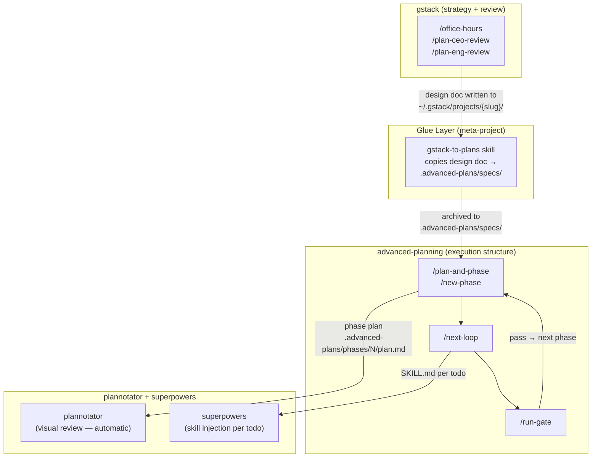

# Advanced AI Workflows

**An integrated planning-review-execution system built from four composable open-source tools — gstack, advanced-planning, superpowers, and plannotator.**

> **Scope: Claude Code only in v0.1.** The CLAUDE.md routing, `.claude/skills/` install paths, and `.claude/settings.json` permission grants are all Claude Code-specific. Multi-runtime support (OpenCode, Gemini CLI) is a v0.2+ ROADMAP item. Each sub-package may support additional runtimes independently; the *integrated four-tool flow* does not in v0.1.

---

## The Four Tools

### gstack

[`MungoHarvey/gstack`](https://github.com/MungoHarvey/gstack) (or your local gstack install at `~/.claude/skills/gstack/`)

High-level strategic planner and reviewer. Commands like `/office-hours`, `/plan-ceo-review`, `/plan-eng-review`, `/plan-design-review`, and `/codex` are the entry points for ambiguous problems, strategy sessions, and second-opinion reviews. Gstack writes design docs to `~/.gstack/projects/{slug}/` — the immutable origin outside the project repo.

### advanced-planning

[`MungoHarvey/advanced-planning`](https://github.com/MungoHarvey/advanced-planning)

Hierarchical multi-agent planning framework that decomposes complex programmes into Phases, Ralph Loops, and Todos. Solves the three hardest problems in long-running agentic work: context degradation, scope drift, and session resumption. Plans live in `.advanced-plans/` in the project repo (v0.11.0+).

### superpowers

[`MungoHarvey/superpowers`](https://github.com/MungoHarvey/superpowers) (fork of [`obra/superpowers`](https://github.com/obra/superpowers))

Composable development methodology skills. Provides brainstorming, TDD, subagent-driven development, and code review as modular skills injected contextually. Tactical helper invoked throughout execution — not the main planning engine. When installed alongside advanced-planning, brainstorming and writing-plans output lands in `.advanced-plans/specs/` via a CLAUDE.md preference override.

### plannotator

[`MungoHarvey/plannotator`](https://github.com/MungoHarvey/plannotator) (fork of [`backnotprop/plannotator`](https://github.com/backnotprop/plannotator))

Browser-based visual plan review and annotation UI. When a phase plan is ready, plannotator opens an interactive interface where you can approve, deny, or annotate with structured feedback. Integration is **automatic** — advanced-planning's `/plan-and-phase` Step 5b auto-invokes `/plannotator-annotate` when plannotator is detected, and plannotator's own `EnterPlanMode`/`ExitPlanMode` hooks fire on every plan-mode event.

---

## How They Work Together


```mermaid
flowchart TB
    accTitle: Four-Tool Integration Flow
    accDescr: gstack at the top produces design docs; the gstack-to-plans glue copies them into .advanced-plans/specs/; advanced-planning consumes them to build phase plans; plannotator and superpowers provide review and methodology.

    subgraph gstack_layer["gstack (strategy + review)"]
        gh["/office-hours<br/>/plan-ceo-review<br/>/plan-eng-review"]
    end

    subgraph glue_layer["Glue Layer (meta-project)"]
        gl["gstack-to-plans skill<br/>copies design doc →<br/>.advanced-plans/specs/"]
    end

    subgraph ap_layer["advanced-planning (execution structure)"]
        pp["/plan-and-phase<br/>/new-phase"]
        rl["/next-loop"]
        rg["/run-gate"]
    end

    subgraph review_layer["plannotator + superpowers"]
        pn["plannotator<br/>(visual review — automatic)"]
        sp["superpowers<br/>(skill injection per todo)"]
    end

    gh -->|"design doc written to<br/>~/.gstack/projects/{slug}/"| gl
    gl -->|"archived to<br/>.advanced-plans/specs/"| pp
    pp -->|"phase plan<br/>.advanced-plans/phases/N/plan.md"| pn
    pp --> rl
    rl -->|"SKILL.md per todo"| sp
    rl --> rg
    rg -->|"pass → next phase"| pp

    classDef gstack fill:#dbeafe,stroke:#2563eb,color:#1e3a5f
    classDef glue fill:#fef3c7,stroke:#d97706,color:#713f12
    classDef ap fill:#dcfce7,stroke:#16a34a,color:#14532d
    classDef review fill:#f3e8ff,stroke:#9333ea,color:#4a044e

    class gh gstack_layer
    class gl glue_layer
    class pp,rl,rg ap_layer
    class pn,sp review_layer
```

The four tools are unaware of each other. The meta-project owns the glue — a single `gstack-to-plans` skill and a CLAUDE.md routing template that routes user intent to the right tool at the right moment. No tool needs to know the other's internals; they communicate through files.

**The full cycle:** `/office-hours` (gstack) → `/gstack-to-plans` (glue) → `/plan-and-phase` (advanced-planning) → visual review (plannotator, automatic) → `/next-loop` (advanced-planning + superpowers skills) → `/run-gate` → `/next-phase`.

---

## Quick Start

Install the setup skill and tell Claude to set up your project:

```bash
mkdir -p ~/.claude/skills/setup-with-claude
curl -fsSL https://raw.githubusercontent.com/MungoHarvey/advanced-ai-workflows/main/.claude/skills/setup-with-claude/SKILL.md \
  -o ~/.claude/skills/setup-with-claude/SKILL.md
```

Then in any Claude Code session: *"Set up advanced AI workflows in this project."*

Claude will walk you through detecting and installing each sub-package, wiring the CLAUDE.md routing block, granting `.advanced-plans/` permissions in `.claude/settings.json`, and installing the `gstack-to-plans` glue skill.

**Manual setup:** follow the step-by-step walkthrough in [SETUP.md](SETUP.md).

---

## Documentation

| Document | Description |
|----------|-------------|
| [ARCHITECTURE.md](ARCHITECTURE.md) | System architecture, component boundaries, glue layer, and data flow |
| [DESIGN-RATIONALE.md](DESIGN-RATIONALE.md) | Why these tools, why this integration approach, key trade-offs |
| [SETUP.md](SETUP.md) | Installation, version compatibility matrix, configuration, and first-run walkthrough |
| [ROADMAP.md](ROADMAP.md) | v0.1 status, deferred items, and multi-runtime trajectory |

---

## Skills Ecosystem

Each todo in a ralph loop can have a skill injected — a focused markdown file that shapes how the agent approaches that specific task. The right skill turns a generic agent into a domain specialist for exactly the duration it needs to be one.

- [awesome-agent-skills](https://github.com/MungoHarvey/awesome-agent-skills) — community-curated catalogue of agent skills
- [claude-scientific-skills](https://github.com/K-Dense-AI/claude-scientific-skills) — scientific research skills for Claude
- [anthropic skills](https://github.com/anthropics/skills) — official Anthropic reference implementations

---

## Licence

TBD
