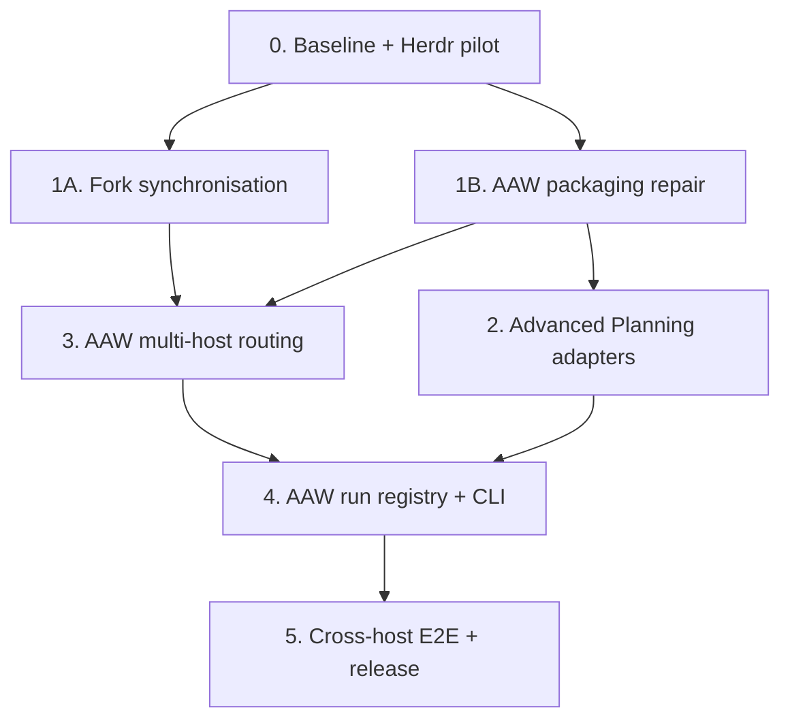

# Roadmap

---

## v0.1 — Done

**Four-tool integration: gstack + advanced-planning + superpowers + plannotator (Claude Code only)**

> Released as **v0.1.0**, tagged retrospectively on 2026-08-26 at `3422a8c`. See [CHANGELOG.md](CHANGELOG.md).
> Plannotator was deprecated on 2026-08-26 and is not part of the stack from v0.2 onward; the list below records what v0.1 actually shipped.

- **gstack-to-plans glue skill** — pure markdown `SKILL.md` with no executable helpers. Copies gstack design docs from `~/.gstack/projects/{slug}/` to `.advanced-plans/specs/`. Ask-when-unsure semantics at every ambiguous branch (multiple source matches, destination exists, unexpected filename pattern).
- **PostToolUse auto-trigger hook** — `PostToolUse Write` matcher scoped strictly to `~/.gstack/projects/`. Surfaces `/gstack-to-plans` suggestion in Claude's next turn when a gstack design doc is written. Fallback: manual `/gstack-to-plans` command + CLAUDE.md closing instruction.
- **CLAUDE.md routing template** — four-tool front-door rules with superpowers preference overrides (brainstorming and writing-plans save to `.advanced-plans/specs/`). Fenced begin/end markers for clean install/uninstall.
- **setup-with-claude** rewritten as instructions-Claude-reads — walks Claude through detect, install, wire routing, grant permissions, install glue, write integrations.json, verify. Supports `--uninstall` and `--refresh`.
- **Five repo doc rewrites** (README, ARCHITECTURE, DESIGN-RATIONALE, SETUP, ROADMAP) — four-tool framing, updated Mermaid diagrams, handoff contract table, honest Claude-only positioning.
- **Fork fix: advanced-planning STRUCTURE.md** — branch in `MungoHarvey/advanced-planning` correcting stale path references (`plans/`, `.claude/plans/`, `PLANS-INDEX.md` → `.advanced-plans/`). Pure documentation fix. Held until after v0.1 smoke test in case additional stale references surface.
- **Fork fix: superpowers brainstorming default path** — merged into `MungoHarvey/superpowers` main. Updates the AP-detected default from `.claude/plans/` to `.advanced-plans/specs/`. Behavioural change, two lines. The CLAUDE.md preference override remains as a belt-and-braces fallback for non-fork installs.

> **Scope note:** Both fixes target our own forks/repos. The meta-project consumes our forks because we have modified them to work together as a stack — that is the entire reason the forks exist. Promotion of either fix to a public upstream (`obra/superpowers`, etc.) is a separate, explicit decision deferred to v0.2 or later.

---

## v0.2 — Herdr-managed multi-runtime orchestration

**Status:** implementation-ready design, not yet built. Full specification: [2026-08-26-herdr-multi-runtime-orchestration-design.md](.advanced-plans/specs/2026-08-26-herdr-multi-runtime-orchestration-design.md).

v0.2 adopts **Herdr as the terminal and session runtime** rather than building another multiplexer. AAW stays the workflow and integration layer; Advanced Planning stays the sole owner of programme state. Herdr supplies persistent native-Windows panes, Git worktrees, agent lifecycle detection, and session restore across Claude Code, Codex, OpenCode, and Cursor.

> **Scope change from the earlier v0.2 plan.** The previous roadmap framed v0.2 as "port the glue layer to OpenCode and Gemini CLI". That framing is superseded. The target runtimes are now **Claude Code, Codex, OpenCode, and Cursor** — Gemini CLI is no longer a v0.2 target. The work is also larger than routing: it adds an execution runtime (Herdr), a controller/worker state boundary, versioned task and result contracts, and a packaging repair that must land before any new installer is published.

> **Blocking defect carried into v0.2.** The repository documents and installs `.claude/skills/gstack-to-plans/SKILL.md`, but that source is not tracked (`.gitignore` whitelists only `setup-with-claude/`). Workstream 1B repairs this. Until it lands, the v0.1 Quick Start is not a verified fresh-install route at this head.

### Delivery order

### Workstreams and exit gates

| # | Workstream | Principal deliverables | Exit gate (abridged) |
|---|---|---|---|
| 0 | Safety baseline and Herdr pilot | Herdr stable installed natively on Windows; integrations for `claude`, `codex`, `opencode`, `cursor`; recorded repository heads; branch/tag/push policy | Herdr reports `working`, `idle/done`, `blocked` correctly; Windows paths with spaces work; a clean Herdr worktree removes without `--force` |
| 1A | Synchronise component forks | gstack synced from upstream; Superpowers rebranched from upstream with integration intent reimplemented (preferably as AAW-owned routing). *Plannotator fast-forward removed — deprecated 2026-08-26.* | Upstream/fork relationships recorded at full SHAs; upstream suites pass; Superpowers behaviour matrix passes with and without Advanced Planning |
| 1B | Repair AAW packaging | Restore and track `gstack-to-plans/SKILL.md`; packaging test that fails on any missing documented install source; installation manifest replacing stale-directory detection; deterministic non-interactive audit/install; generated compatibility manifest | Fresh checkout contains every documented source artifact; stale `.advanced-plans/` alone no longer counts as installed; install/refresh/audit/uninstall are idempotent |
| 2 | Advanced Planning multi-runtime adapters | Host-neutral skills/schemas moved to core; Claude Code, Codex, OpenCode, Cursor adapter installers; immutable external-task and collected-evidence schemas; cross-model gate reviewer contract | All four hosts discover the same named core skills; only the control checkout updates programme state; evidence advances a loop only after schema and gate validation |
| 3 | AAW multi-host routing and installer | Tracked `.aaw/project.toml`; fenced `AGENTS.md` block shared by Codex/OpenCode/Cursor; updated fenced `CLAUDE.md`; skills installed to `.agents/skills/` and `.claude/skills/`; manifest-driven component detection | No host detected only by another host's private path; install/refresh preserve user-authored content outside fenced blocks; the three-tool flow works on Claude, planning-to-task works on the other three |
| 4 | AAW registry and dispatcher | Zero-dependency Python package and `aaw` entry point; SQLite migrations; Herdr CLI adapter; run state machine; `doctor`, `dispatch`, `list`, `inspect`, `prompt`, `attach`, `collect`, `review`, `stop`, `resume`, `clean`; redaction and retention policy | Interruption does not corrupt the registry; a restored session rebinds to its run; collector catches writes outside `allowed_paths`; `clean` refuses a dirty or non-terminal worktree |
| 5 | End-to-end release | Windows-native compatibility matrix; fixture repos and recorded commands for all four hosts; fork/update and install/refresh/uninstall regression suites; full design-to-gate scenario across two providers | All critical acceptance scenarios pass from fresh clones; docs claim no integration that was only simulated; release commits match manifest SHAs |

Release tags on completion: **AAW v0.2.0** and **Advanced Planning v0.17.0**.

### Acceptance scenarios

Eighteen scenarios (ACC-01 – ACC-18) gate the release. The load-bearing ones:

- **ACC-01** — fresh Windows install in a path containing spaces; `doctor` passes and every configured host discovers the intended guidance.
- **ACC-02** — stale `.advanced-plans/` without an adapter reports *data present, Advanced Planning absent*.
- **ACC-04 / ACC-05** — Superpowers behaves correctly both with and without Advanced Planning; no AAW path is fabricated when AP is absent.
- **ACC-07 / ACC-08** — concurrent writing tasks get distinct branches and one declared owner each; a worker attempting a planning-state edit fails collection.
- **ACC-11 / ACC-12** — a Herdr server restart never yields a false `completed`; an idle agent with a failing test is marked review/failed, because idle is not success.
- **ACC-13 / ACC-17** — writes outside declared scope block completion; `clean` refuses a dirty worktree rather than forcing.
- **ACC-18** — the gate reviewer is a different model from the implementer, and findings are resolved or explicitly waived by a human.

Full table: §15 of the design document.

### Definition of done

v0.2 is complete only when the three forks are current through reviewed branches; AAW contains every source artifact it tells users to install; Advanced Planning has tested adapters for all four runtimes; Herdr is the documented and tested execution backend on native Windows; worktree ownership and sole-planning-state-writer rules are enforced; task and result contracts are versioned and validated; the registry survives interruption and never equates terminal idle with success; install, refresh, sync, run, review, resume, and safe cleanup all have acceptance evidence; every user-facing claim matches observed behaviour; and release tags plus the compatibility manifest point at the exact tested commits.

### Implementation plan

The design is decomposed into Advanced Planning phases 3-9 in
[`.advanced-plans/PLANS-INDEX.md`](.advanced-plans/PLANS-INDEX.md):

| Workstream | Phase | Loops |
|---|---|---|
| 0 — Safety baseline and Herdr pilot | [3](.advanced-plans/phases/phase-3/plan.md) | decomposed |
| 1A gstack + 1B packaging repair | [4](.advanced-plans/phases/phase-4/plan.md) | decomposed |
| 1A Superpowers behavioural port | [5](.advanced-plans/phases/phase-5/plan.md) | decomposed |
| 2 — Advanced Planning adapters | [6](.advanced-plans/phases/phase-6/plan.md) | deferred |
| 3 — AAW multi-host routing | [7](.advanced-plans/phases/phase-7/plan.md) | deferred |
| 4 — AAW registry and dispatcher | [8](.advanced-plans/phases/phase-8/plan.md) | deferred |
| 5 — Cross-host E2E and release | [9](.advanced-plans/phases/phase-9/plan.md) | deferred |

Phases 3-5 are the authorised execution scope. Phases 6-9 are planned at phase level only; the
registry and CLI are explicitly not to be implemented yet.

### Operating guides

- [Herdr Windows operations](docs/herdr-windows-operations.md) — native-Windows pilot, worktrees, provider sessions, evidence, safe cleanup.
- [Upstream sync playbook](docs/upstream-sync-playbook.md) — Workstream 1A procedures and current fork divergence.
- [Upstream baseline snapshot](references/upstream-baseline-2026-08-26.json) — machine-readable heads, divergence, and sync strategy.
- [Herdr kickoff prompt](docs/herdr-kickoff-prompt.md) — paste-ready controller prompt to start the programme.
- [Baseline audit](.advanced-plans/evidence/2026-08-26-baseline-audit.md) — verified environment and repository heads at full SHAs.
- [Plannotator deprecation](docs/plannotator-deprecation.md) — rationale, replacement review gate, and migration.
- [Releasing](docs/releasing.md) — versioning scheme and the push/tag human gate.
- [Programme Git policy](docs/programme-git-policy.md) — branch and tag names, the per-repository check command, and the three human gates.
- [Worktree ownership](docs/worktree-ownership.md) — one owner per checkout, the controller-sole-writer rule, and why a worktree is not a sandbox.
- [Herdr pilot report](.advanced-plans/evidence/2026-08-26-phase-3-loop-002-herdr-pilot.md) — the ten-item Step 4 pilot and its four findings.

---

## Deferred beyond v0.2

### gate-to-gstack-review glue skill

When `/run-gate` produces a verdict, invoking gstack's `/plan-eng-review` or `/codex` for a second opinion is the natural next step. Gate verdicts remain text-only and do not surface to gstack automatically.

The skill would mirror `gstack-to-plans` in the other direction: read the gate verdict JSON from `.advanced-plans/phases/phase-N/gate-verdicts/`, format it as a gstack-compatible summary, and invoke `/plan-eng-review` or `/codex` with the relevant context, with the same ask-when-unsure semantics.

Note that v0.2's ACC-18 already requires a cross-model gate reviewer, so part of the original motivation is addressed by the dispatcher rather than by this skill.

### Gemini CLI support

Dropped from the v0.2 runtime set in favour of Codex and Cursor. The adapter pattern established in Workstream 2 is what a future Gemini CLI adapter would extend.

---

## Skipped (will not happen)

- `/aaw-status` cross-tool status command — companion-detection in advanced-planning already handles superpowers detection at natural trigger points. gstack is implicit when gstack commands run. No need for parallel command.
- `/aaw-flow` umbrella command — rebuilds what individual tools already do well.
- Plannotator-on-design-doc glue — moot: plannotator was deprecated on 2026-08-26. See [docs/plannotator-deprecation.md](docs/plannotator-deprecation.md).
- First-run guided tour skill — scope creep without clear payoff.
